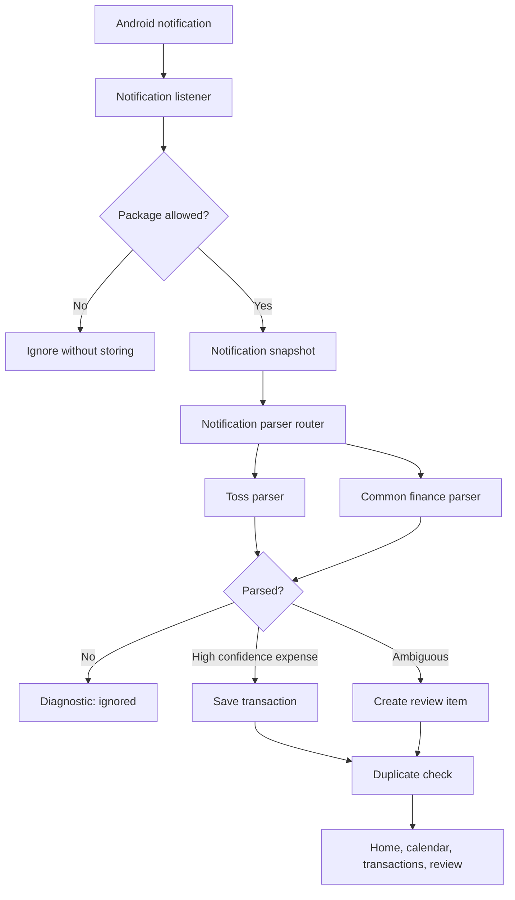

# Financial Notification Router Final Review Package

Repository note: no HEAD commit exists; package contains current contents of feature-relevant files.
Verification already run by controller: :app:testDebugUnitTest :app:assembleDebug => BUILD SUCCESSFUL on 2026-07-03.
Device test status: pending because adb devices currently shows no connected device.

## git status
```
?? .gitignore
?? .superpowers/
?? README.md
?? app/
?? build.gradle.kts
?? docs/
?? gradle.properties
?? gradle/
?? gradlew
?? gradlew.bat
?? settings.gradle.kts
```

## docs\superpowers\specs\2026-07-03-financial-notification-router-design.md
`$fence
# Financial Notification Router Design

## Goal

AutoMoney should no longer depend only on Toss notifications. If a user pays with or transfers from another financial app, such as KB Kookmin Bank, the app should read that notification, detect likely money movement, and turn it into either an automatic transaction or a review item.

The safest first version is not "read every notification with numbers." It is an allowlisted financial-app router with conservative parsing. High-confidence card payments can be recorded automatically. Transfers, top-ups, refunds, deposits, account movement, and low-confidence matches go to Review.

## Current Problem

The notification listener currently returns immediately unless the package is Toss:

```kotlin
if (sbn.packageName != "viva.republica.toss") return
```

That means KB Kookmin Bank notifications are ignored before the parser sees them. This blocks real-world usage when Toss does not send an alert for activity that happened through another bank app.

## Recommended Approach

Use a notification router:

1. Accept notifications only from known or user-enabled financial apps.
2. Route Toss notifications to the existing Toss parser.
3. Route bank/card/pay app notifications to a common Korean finance parser.
4. Save high-confidence spending automatically.
5. Send ambiguous money movement to Review with a masked text preview.

This keeps the app useful without creating noisy records from shopping ads, coupons, delivery promotions, or random messages containing money-like won text.

## Scope

Included:

- Replace the hardcoded Toss-only listener filter with an allowlist check.
- Add a small registry of supported financial app packages.
- Add a parser interface so Toss and common finance parsing can coexist.
- Add a common Korean finance parser for amount and keyword detection.
- Mask account-like numbers before storing diagnostics or review text.
- Extend diagnostics to show which app produced the latest processed notification.
- Add tests for KB-style examples, card approval, transfer, deposit, top-up, refund, and promotional false positives.

Not included:

- OCR, SMS reading, email reading, or screen scraping.
- Automatic bank account balance syncing.
- Cloud backup or multi-device sync.
- Reading every installed app's notifications.
- Saving full account numbers.

## Data Flow



## Components

### Financial App Registry

Purpose: decide whether a notification should be inspected.

Initial behavior:

- Toss is enabled by default.
- KB Kookmin Bank can be added as a supported financial app.
- Unknown apps are ignored.
- Settings toggles are not required for the first implementation, but the registry should be structured so toggles can be added later without changing parser logic.

The first implementation should match exact package names. Android PackageManager labels may be used for display in diagnostics, but they should not be the primary matching rule.

### Parser Router

Purpose: pick the right parser for a notification snapshot.

Suggested interface:

```kotlin
interface NotificationParser {
    fun canParse(snapshot: NotificationSnapshot): Boolean
    fun parse(snapshot: NotificationSnapshot): ParseResult
}
```

The ingestion use case should depend on this interface or a router, not directly on `TossNotificationParser`.

### Common Korean Finance Parser

Purpose: parse bank, card, and pay notifications that follow common Korean money-alert patterns.

Signals:

- Amount: Korean won amount text, including comma-separated amounts.
- Spending keywords: payment, approval, use, withdrawal.
- Transfer keywords: transfer, remittance, receiver, sender.
- Deposit keywords: deposit, received.
- Top-up keywords: top-up, pay money, point recharge.
- Refund keywords: cancel, refund, approval cancellation.
- Account hints: account, account number, bank account-like number patterns.

Classification:

- Card approval/payment: `EXPENSE`, auto-confirm only when merchant and amount are clear.
- Transfer/withdrawal/account movement: `TRANSFER`, needs review.
- Deposit: `INCOME`, needs review unless the user later defines a trusted rule.
- Wallet top-up: `WALLET_TOPUP`, needs review.
- Refund/cancel: `REFUND`, needs review.
- Promotional or coupon text: ignored.

### Privacy Masking

Before saving text previews, diagnostics, or review memo text, mask sensitive patterns:

- Account-like numbers: keep at most the last 4 digits, for example `****1234`.
- Long continuous numbers that are not amounts should be masked.
- Amounts can remain visible because they are needed for accounting.
- Full notification text should not be stored if a masked preview is enough.

## Review Behavior

The app should stay conservative:

- If the parser is not confident, create a Review item instead of auto-recording.
- If the app sees an account number or transfer keyword, send it to Review.
- If the same amount and same notification hash already exist, mark it as duplicate.
- If a notification has multiple amounts, send it to Review unless the parser can clearly identify the transaction amount.

This matches the product goal: the user should not need to enter everything manually, but they should not have to clean up many wrong records either.

## Settings UI

This implementation should rename Toss-specific Settings text to a broader phrase:

- Current meaning: "When Toss payment or transfer notifications arrive..."
- Proposed meaning: "When notifications from allowed financial apps arrive, process them as automatic record candidates."

The existing real-notification diagnostics card should show:

- Source app label or package name.
- Result: saved, duplicate, ignored, error.
- Parsed type if available.
- Masked text preview.

## Error Handling

- If package is not allowlisted: ignore silently.
- If package is allowlisted but parsing fails: save diagnostic as ignored with reason.
- If parser throws: save diagnostic as error and continue listening.
- If duplicate: save diagnostic as duplicate.
- If a notification lacks amount or finance keywords: ignored.

## Testing Plan

Unit tests:

- Toss parser still works as before.
- Listener/package filtering accepts Toss and configured finance apps.
- Common parser extracts amount from Korean won text.
- KB-style card payment becomes high-confidence expense.
- KB-style transfer becomes needs-review transfer.
- Deposit becomes needs-review income.
- Wallet top-up becomes needs-review wallet top-up.
- Refund/cancel becomes needs-review refund.
- Promotion or coupon notifications with money amounts are ignored.
- Account-like numbers are masked before saved previews.

Device tests:

- Install on Galaxy phone.
- Enable notification access.
- Trigger a real KB Kookmin Bank notification.
- Check Settings diagnostics.
- Check Review or Transactions.
- Adjust examples based on real notification wording.

## Acceptance Criteria

- KB Kookmin Bank notifications are no longer ignored solely because they are not Toss.
- Supported financial apps can be added without changing the listener logic.
- Toss parsing remains functional.
- Bank transfer/account movement records go to Review, not automatic expense.
- Sensitive account-like numbers are masked.
- Promotional notifications with money amounts are ignored.
- Full unit test suite and debug build pass.
```

## docs\superpowers\plans\2026-07-03-financial-notification-router.md
`$fence
# Financial Notification Router Implementation Plan

> **For agentic workers:** REQUIRED SUB-SKILL: Use superpowers:subagent-driven-development (recommended) or superpowers:executing-plans to implement this plan task-by-task. Steps use checkbox (`- [ ]`) syntax for tracking.

**Goal:** Extend AutoMoney from Toss-only notification ingestion to allowlisted financial-app notification ingestion, starting with KB Star Banking.

**Architecture:** Introduce a `NotificationParser` interface and a parser router. Keep the existing Toss parser, add a common Korean finance parser, and replace the listener's hardcoded Toss filter with a small financial-app registry. Keep parsing conservative: clear card payments can auto-save, while transfers, deposits, top-ups, refunds, account movements, and low-confidence matches go to Review.

**Tech Stack:** Kotlin, Android NotificationListenerService, Jetpack Compose Material3, Room, JUnit, Truth, Gradle.

## Global Constraints

- Do not read all notifications; inspect only allowlisted financial app packages.
- Do not add OCR, SMS reading, email reading, screen scraping, cloud sync, or balance syncing.
- Do not store full account-like numbers; mask sensitive number patterns before saving diagnostics or review-facing text.
- Do not change the Room schema unless implementation proves it is unavoidable.
- Keep Toss parsing functional.
- In this repository, do not create partial commits until the initial untracked project baseline is intentionally staged.

---

## File Structure

- Create `app/src/main/java/com/choiyoonseo/automoney/domain/parser/NotificationParser.kt`
  - Owns the parser interface used by Toss, common finance parser, and the router.
- Create `app/src/main/java/com/choiyoonseo/automoney/domain/parser/NotificationParserRouter.kt`
  - Selects the first parser that can parse a snapshot.
- Modify `app/src/main/java/com/choiyoonseo/automoney/domain/parser/TossNotificationParser.kt`
  - Implements `NotificationParser`.
- Create `app/src/main/java/com/choiyoonseo/automoney/notification/FinancialAppRegistry.kt`
  - Owns exact package allowlist constants, including Toss and KB Star Banking.
- Modify `app/src/main/java/com/choiyoonseo/automoney/notification/MoneyNotificationListenerService.kt`
  - Uses the registry instead of the hardcoded Toss check.
- Create `app/src/main/java/com/choiyoonseo/automoney/domain/parser/SensitiveTextMasker.kt`
  - Masks account-like and long non-amount numbers.
- Modify `app/src/main/java/com/choiyoonseo/automoney/notification/NotificationDiagnosticsStore.kt`
  - Saves masked previews and richer ingestion messages.
- Create `app/src/main/java/com/choiyoonseo/automoney/domain/parser/CommonFinanceNotificationParser.kt`
  - Parses KB/bank/card/pay notifications with conservative Korean finance keyword rules.
- Modify `app/src/main/java/com/choiyoonseo/automoney/notification/NotificationIngestionUseCase.kt`
  - Depends on `NotificationParser` instead of `TossNotificationParser`; returns detailed ingestion results.
- Modify `app/src/main/java/com/choiyoonseo/automoney/di/AppContainer.kt`
  - Wires `NotificationParserRouter(TossNotificationParser(), CommonFinanceNotificationParser())`.
- Modify `app/src/main/java/com/choiyoonseo/automoney/ui/settings/SettingsScreen.kt`
  - Renames Toss-specific copy to financial-app copy and shows richer diagnostics.
- Tests:
  - Create `app/src/test/java/com/choiyoonseo/automoney/domain/parser/NotificationParserRouterTest.kt`
  - Create `app/src/test/java/com/choiyoonseo/automoney/notification/FinancialAppRegistryTest.kt`
  - Create `app/src/test/java/com/choiyoonseo/automoney/domain/parser/SensitiveTextMaskerTest.kt`
  - Create `app/src/test/java/com/choiyoonseo/automoney/domain/parser/CommonFinanceNotificationParserTest.kt`
  - Modify existing notification ingestion and diagnostics tests as needed.

---

### Task 1: Parser Interface And Router

**Files:**
- Create: `app/src/main/java/com/choiyoonseo/automoney/domain/parser/NotificationParser.kt`
- Create: `app/src/main/java/com/choiyoonseo/automoney/domain/parser/NotificationParserRouter.kt`
- Modify: `app/src/main/java/com/choiyoonseo/automoney/domain/parser/TossNotificationParser.kt`
- Test: `app/src/test/java/com/choiyoonseo/automoney/domain/parser/NotificationParserRouterTest.kt`

**Interfaces:**
- Produces: `interface NotificationParser`
- Produces: `class NotificationParserRouter(private val parsers: List<NotificationParser>) : NotificationParser`
- Consumes: existing `NotificationSnapshot` and `ParseResult`

- [x] **Step 1: Write failing router tests**

```kotlin
package com.choiyoonseo.automoney.domain.parser

import com.google.common.truth.Truth.assertThat
import java.time.Instant
import org.junit.Test

class NotificationParserRouterTest {
    @Test
    fun routesToFirstParserThatCanParse() {
        val parser = RecordingParser(canParse = true, result = ParseResult.Ignored("handled"))
        val fallback = RecordingParser(canParse = true, result = ParseResult.Ignored("fallback"))
        val router = NotificationParserRouter(listOf(parser, fallback))

        val result = router.parse(snapshot("viva.republica.toss"))

        assertThat(result).isEqualTo(ParseResult.Ignored("handled"))
        assertThat(parser.parseCalls).isEqualTo(1)
        assertThat(fallback.parseCalls).isEqualTo(0)
    }

    @Test
    fun ignoresWhenNoParserCanParse() {
        val router = NotificationParserRouter(listOf(RecordingParser(canParse = false)))

        val result = router.parse(snapshot("unknown.package"))

        assertThat(result).isEqualTo(ParseResult.Ignored("unsupported package"))
    }

    private fun snapshot(packageName: String) = NotificationSnapshot(
        packageName = packageName,
        title = "title",
        text = "text",
        bigText = null,
        postedAt = Instant.parse("2026-07-03T01:00:00Z")
    )

    private class RecordingParser(
        private val canParse: Boolean,
        private val result: ParseResult = ParseResult.Ignored("unused")
    ) : NotificationParser {
        var parseCalls = 0

        override fun canParse(snapshot: NotificationSnapshot): Boolean = canParse

        override fun parse(snapshot: NotificationSnapshot): ParseResult {
            parseCalls += 1
            return result
        }
    }
}
```

- [x] **Step 2: Run the failing router test**

Run:

```powershell
$env:JAVA_HOME='D:\Android Studio\jbr'; $env:Path="$env:JAVA_HOME\bin;$env:Path"; .\gradlew.bat :app:testDebugUnitTest --tests com.choiyoonseo.automoney.domain.parser.NotificationParserRouterTest --no-daemon --console=plain
```

Expected: FAIL with unresolved reference for `NotificationParser` or `NotificationParserRouter`.

- [x] **Step 3: Add the parser interface**

```kotlin
package com.choiyoonseo.automoney.domain.parser

interface NotificationParser {
    fun canParse(snapshot: NotificationSnapshot): Boolean
    fun parse(snapshot: NotificationSnapshot): ParseResult
}
```

- [x] **Step 4: Add the parser router**

```kotlin
package com.choiyoonseo.automoney.domain.parser

class NotificationParserRouter(
    private val parsers: List<NotificationParser>
) : NotificationParser {
    override fun canParse(snapshot: NotificationSnapshot): Boolean =
        parsers.any { it.canParse(snapshot) }

    override fun parse(snapshot: NotificationSnapshot): ParseResult {
        val parser = parsers.firstOrNull { it.canParse(snapshot) }
            ?: return ParseResult.Ignored("unsupported package")
        return parser.parse(snapshot)
    }
}
```

- [x] **Step 5: Make Toss parser implement the interface**

Change the class declaration and add `canParse`:

```kotlin
class TossNotificationParser : NotificationParser {
    override fun canParse(snapshot: NotificationSnapshot): Boolean =
        snapshot.packageName == TOSS_PACKAGE

    override fun parse(snapshot: NotificationSnapshot): ParseResult {
        if (!canParse(snapshot)) {
            return ParseResult.Ignored("unsupported package")
        }
        // keep existing parse body
    }
}
```

- [x] **Step 6: Run router and Toss parser tests**

Run:

```powershell
$env:JAVA_HOME='D:\Android Studio\jbr'; $env:Path="$env:JAVA_HOME\bin;$env:Path"; .\gradlew.bat :app:testDebugUnitTest --tests com.choiyoonseo.automoney.domain.parser.NotificationParserRouterTest --tests com.choiyoonseo.automoney.domain.parser.TossNotificationParserTest --no-daemon --console=plain
```

Expected: PASS.

---

### Task 2: Financial App Registry And Listener Filtering

**Files:**
- Create: `app/src/main/java/com/choiyoonseo/automoney/notification/FinancialAppRegistry.kt`
- Modify: `app/src/main/java/com/choiyoonseo/automoney/notification/MoneyNotificationListenerService.kt`
- Test: `app/src/test/java/com/choiyoonseo/automoney/notification/FinancialAppRegistryTest.kt`

**Interfaces:**
- Produces: `object FinancialAppRegistry`
- Produces: `fun isSupportedPackage(packageName: String): Boolean`
- Produces constants: `TOSS_PACKAGE`, `KB_STAR_BANKING_PACKAGE`

- [x] **Step 1: Write failing registry tests**

```kotlin
package com.choiyoonseo.automoney.notification

import com.google.common.truth.Truth.assertThat
import org.junit.Test

class FinancialAppRegistryTest {
    @Test
    fun supportsTossAndKbStarBanking() {
        assertThat(FinancialAppRegistry.isSupportedPackage("viva.republica.toss")).isTrue()
        assertThat(FinancialAppRegistry.isSupportedPackage("com.kbstar.kbbank")).isTrue()
    }

    @Test
    fun rejectsUnknownAndBlankPackages() {
        assertThat(FinancialAppRegistry.isSupportedPackage("com.shopping.adapp")).isFalse()
        assertThat(FinancialAppRegistry.isSupportedPackage("")).isFalse()
    }
}
```

- [x] **Step 2: Run the failing registry test**

Run:

```powershell
$env:JAVA_HOME='D:\Android Studio\jbr'; $env:Path="$env:JAVA_HOME\bin;$env:Path"; .\gradlew.bat :app:testDebugUnitTest --tests com.choiyoonseo.automoney.notification.FinancialAppRegistryTest --no-daemon --console=plain
```

Expected: FAIL with unresolved reference `FinancialAppRegistry`.

- [x] **Step 3: Add the registry**

```kotlin
package com.choiyoonseo.automoney.notification

object FinancialAppRegistry {
    const val TOSS_PACKAGE = "viva.republica.toss"
    const val KB_STAR_BANKING_PACKAGE = "com.kbstar.kbbank"

    private val supportedPackages = setOf(
        TOSS_PACKAGE,
        KB_STAR_BANKING_PACKAGE
    )

    fun isSupportedPackage(packageName: String): Boolean =
        packageName in supportedPackages
}
```

Note: `com.kbstar.kbbank` is the Google Play package id for KB Star Banking.

- [x] **Step 4: Replace the listener's hardcoded Toss filter**

Change:

```kotlin
if (sbn.packageName != "viva.republica.toss") return
```

To:

```kotlin
if (!FinancialAppRegistry.isSupportedPackage(sbn.packageName)) return
```

- [x] **Step 5: Run registry test and compile**

Run:

```powershell
$env:JAVA_HOME='D:\Android Studio\jbr'; $env:Path="$env:JAVA_HOME\bin;$env:Path"; .\gradlew.bat :app:testDebugUnitTest --tests com.choiyoonseo.automoney.notification.FinancialAppRegistryTest :app:assembleDebug --no-daemon --console=plain
```

Expected: PASS and debug build succeeds.

---

### Task 3: Sensitive Text Masking

**Files:**
- Create: `app/src/main/java/com/choiyoonseo/automoney/domain/parser/SensitiveTextMasker.kt`
- Modify: `app/src/main/java/com/choiyoonseo/automoney/notification/NotificationDiagnosticsStore.kt`
- Test: `app/src/test/java/com/choiyoonseo/automoney/domain/parser/SensitiveTextMaskerTest.kt`
- Test: `app/src/test/java/com/choiyoonseo/automoney/notification/NotificationDiagnosticsStoreTest.kt`

**Interfaces:**
- Produces: `object SensitiveTextMasker`
- Produces: `fun mask(text: String): String`
- Consumes: `LastNotificationDiagnostic.fromIngestionResult(...)`

- [x] **Step 1: Write failing masking tests**

```kotlin
package com.choiyoonseo.automoney.domain.parser

import com.google.common.truth.Truth.assertThat
import org.junit.Test

class SensitiveTextMaskerTest {
    @Test
    fun masksAccountLikeNumbersButKeepsAmounts() {
        val text = "KB 123456-78-901234 account 10,000 won payment"

        val masked = SensitiveTextMasker.mask(text)

        assertThat(masked).contains("****1234")
        assertThat(masked).contains("10,000 won")
        assertThat(masked).doesNotContain("123456-78-901234")
    }

    @Test
    fun masksLongPlainNumbers() {
        val masked = SensitiveTextMasker.mask("sender 110123456789 sent 5,000 won")

        assertThat(masked).contains("****6789")
        assertThat(masked).doesNotContain("110123456789")
    }
}
```

- [x] **Step 2: Run the failing masking test**

Run:

```powershell
$env:JAVA_HOME='D:\Android Studio\jbr'; $env:Path="$env:JAVA_HOME\bin;$env:Path"; .\gradlew.bat :app:testDebugUnitTest --tests com.choiyoonseo.automoney.domain.parser.SensitiveTextMaskerTest --no-daemon --console=plain
```

Expected: FAIL with unresolved reference `SensitiveTextMasker`.

- [x] **Step 3: Add the masker**

```kotlin
package com.choiyoonseo.automoney.domain.parser

object SensitiveTextMasker {
    private val amountLikePattern = Regex("""\d{1,3}(,\d{3})*\s*(won|??""", RegexOption.IGNORE_CASE)
    private val longNumberPattern = Regex("""\d[\d-]{5,}\d""")

    fun mask(text: String): String {
        val protectedAmounts = mutableListOf<String>()
        val protectedText = amountLikePattern.replace(text) { match ->
            val token = "__AMOUNT_${protectedAmounts.size}__"
            protectedAmounts += match.value
            token
        }

        val masked = longNumberPattern.replace(protectedText) { match ->
            val digits = match.value.filter(Char::isDigit)
            if (digits.length < 6) {
                match.value
            } else {
                "****" + digits.takeLast(4)
            }
        }

        return protectedAmounts.foldIndexed(masked) { index, current, amount ->
            current.replace("__AMOUNT_${index}__", amount)
        }
    }
}
```

- [x] **Step 4: Use masking in diagnostic previews**

In `NotificationDiagnosticsStore.kt`, import `SensitiveTextMasker` and apply it in preview creation:

```kotlin
private fun NotificationSnapshot.textPreview(): String {
    val rawPreview = listOfNotNull(title, text, bigText)
        .flatMap { it.lineSequence().map(String::trim).filter(String::isNotBlank).toList() }
        .distinct()
        .joinToString("\n")
        .take(160)
    return SensitiveTextMasker.mask(rawPreview)
}
```

Keep the existing function name if it already exists; replace only its body.

- [x] **Step 5: Add or update diagnostics test for masking**

Add to `NotificationDiagnosticsStoreTest`:

```kotlin
@Test
fun masksSensitiveNumbersInDiagnosticPreview() {
    val diagnostic = LastNotificationDiagnostic.fromIngestionResult(
        snapshot = NotificationSnapshot(
            packageName = "com.kbstar.kbbank",
            title = "KB",
            text = "account 123456-78-901234 10,000 won payment",
            bigText = null,
            postedAt = Instant.parse("2026-07-03T01:00:00Z")
        ),
        result = IngestionResult.Saved,
        receivedAt = Instant.parse("2026-07-03T01:00:05Z")
    )

    assertThat(diagnostic.textPreview).contains("****1234")
    assertThat(diagnostic.textPreview).doesNotContain("123456-78-901234")
}
```

If Task 5 has already changed `IngestionResult.Saved` to a data class, use `IngestionResult.Saved(TransactionType.EXPENSE, null)`.

- [x] **Step 6: Run masking and diagnostics tests**

Run:

```powershell
$env:JAVA_HOME='D:\Android Studio\jbr'; $env:Path="$env:JAVA_HOME\bin;$env:Path"; .\gradlew.bat :app:testDebugUnitTest --tests com.choiyoonseo.automoney.domain.parser.SensitiveTextMaskerTest --tests com.choiyoonseo.automoney.notification.NotificationDiagnosticsStoreTest --no-daemon --console=plain
```

Expected: PASS.

---

### Task 4: Common Korean Finance Parser

**Files:**
- Create: `app/src/main/java/com/choiyoonseo/automoney/domain/parser/CommonFinanceNotificationParser.kt`
- Test: `app/src/test/java/com/choiyoonseo/automoney/domain/parser/CommonFinanceNotificationParserTest.kt`
- Modify: `app/src/main/java/com/choiyoonseo/automoney/domain/model/MoneyModels.kt`

**Interfaces:**
- Produces: `class CommonFinanceNotificationParser : NotificationParser`
- Consumes: `FinancialAppRegistry.KB_STAR_BANKING_PACKAGE`
- Produces parsed `TransactionDraft` values for expense, transfer, income, wallet top-up, and refund.
- Produces new `ReviewReason.INCOME_UNKNOWN` if needed for deposit review items.

- [x] **Step 1: Add deposit review reason**

Add to `ReviewReason`:

```kotlin
INCOME_UNKNOWN
```

Place it after `TRANSFER_UNKNOWN` so existing enum names remain unchanged for persisted values.

- [x] **Step 2: Write failing common parser tests**

```kotlin
package com.choiyoonseo.automoney.domain.parser

import com.choiyoonseo.automoney.domain.model.ReviewReason
import com.choiyoonseo.automoney.domain.model.TransactionDirection
import com.choiyoonseo.automoney.domain.model.TransactionStatus
import com.choiyoonseo.automoney.domain.model.TransactionType
import com.google.common.truth.Truth.assertThat
import java.time.Instant
import org.junit.Test

class CommonFinanceNotificationParserTest {
    private val parser = CommonFinanceNotificationParser()

    @Test
    fun parsesKbCardPaymentAsAutoConfirmedExpense() {
        val result = parser.parse(snapshot(text = "STARBUCKS 6,100${WON} ${APPROVAL}"))

        val draft = (result as ParseResult.Parsed).draft
        assertThat(draft.amount.won).isEqualTo(6100)
        assertThat(draft.direction).isEqualTo(TransactionDirection.EXPENSE)
        assertThat(draft.type).isEqualTo(TransactionType.EXPENSE)
        assertThat(draft.status).isEqualTo(TransactionStatus.AUTO_CONFIRMED)
        assertThat(draft.merchant).isEqualTo("STARBUCKS")
        assertThat(draft.sourceApp).isEqualTo("com.kbstar.kbbank")
    }

    @Test
    fun parsesTransferAsNeedsReview() {
        val result = parser.parse(snapshot(text = "Kim 10,000${WON} ${TRANSFER}"))

        val draft = (result as ParseResult.Parsed).draft
        assertThat(draft.type).isEqualTo(TransactionType.TRANSFER)
        assertThat(draft.status).isEqualTo(TransactionStatus.NEEDS_REVIEW)
        assertThat(draft.reviewReason).isEqualTo(ReviewReason.TRANSFER_UNKNOWN)
    }

    @Test
    fun parsesDepositAsNeedsReviewIncome() {
        val result = parser.parse(snapshot(text = "Company 500,000${WON} ${DEPOSIT}"))

        val draft = (result as ParseResult.Parsed).draft
        assertThat(draft.type).isEqualTo(TransactionType.INCOME)
        assertThat(draft.direction).isEqualTo(TransactionDirection.INCOME)
        assertThat(draft.status).isEqualTo(TransactionStatus.NEEDS_REVIEW)
        assertThat(draft.reviewReason).isEqualTo(ReviewReason.INCOME_UNKNOWN)
    }

    @Test
    fun parsesTopupAsNeedsReviewWalletTopup() {
        val result = parser.parse(snapshot(text = "Naver Pay 10,000${WON} ${TOPUP}"))

        val draft = (result as ParseResult.Parsed).draft
        assertThat(draft.type).isEqualTo(TransactionType.WALLET_TOPUP)
        assertThat(draft.status).isEqualTo(TransactionStatus.NEEDS_REVIEW)
        assertThat(draft.reviewReason).isEqualTo(ReviewReason.WALLET_TOPUP)
    }

    @Test
    fun parsesCancelAsRefundReview() {
        val result = parser.parse(snapshot(text = "Coupang 12,000${WON} ${CANCEL}"))

        val draft = (result as ParseResult.Parsed).draft
        assertThat(draft.type).isEqualTo(TransactionType.REFUND)
        assertThat(draft.status).isEqualTo(TransactionStatus.NEEDS_REVIEW)
        assertThat(draft.reviewReason).isEqualTo(ReviewReason.REFUND_OR_CANCEL)
    }

    @Test
    fun ignoresCouponPromotionWithMoneyAmount() {
        val result = parser.parse(snapshot(text = "Event 10,000${WON} ${COUPON}"))

        assertThat(result).isEqualTo(ParseResult.Ignored("promotional notification"))
    }

    @Test
    fun ignoresUnsupportedPackage() {
        val result = parser.parse(snapshot(packageName = "com.shopping.adapp", text = "STARBUCKS 6,100${WON} ${APPROVAL}"))

        assertThat(result).isEqualTo(ParseResult.Ignored("unsupported package"))
    }

    private fun snapshot(
        packageName: String = "com.kbstar.kbbank",
        text: String
    ) = NotificationSnapshot(
        packageName = packageName,
        title = "KB",
        text = text,
        bigText = null,
        postedAt = Instant.parse("2026-07-03T01:00:00Z")
    )

    companion object {
        private const val WON = "\uc6d0"
        private const val APPROVAL = "\uc2b9\uc778"
        private const val TRANSFER = "\uc774\uccb4"
        private const val DEPOSIT = "\uc785\uae08"
        private const val TOPUP = "\ucda9\uc804"
        private const val CANCEL = "\ucde8\uc18c"
        private const val COUPON = "\ucfe0\ud3f0"
    }
}
```

- [x] **Step 3: Run the failing common parser tests**

Run:

```powershell
$env:JAVA_HOME='D:\Android Studio\jbr'; $env:Path="$env:JAVA_HOME\bin;$env:Path"; .\gradlew.bat :app:testDebugUnitTest --tests com.choiyoonseo.automoney.domain.parser.CommonFinanceNotificationParserTest --no-daemon --console=plain
```

Expected: FAIL with unresolved reference `CommonFinanceNotificationParser`.

- [x] **Step 4: Add the common parser implementation**

```kotlin
package com.choiyoonseo.automoney.domain.parser

import com.choiyoonseo.automoney.domain.model.Category
import com.choiyoonseo.automoney.domain.model.MoneyAmount
import com.choiyoonseo.automoney.domain.model.ReviewReason
import com.choiyoonseo.automoney.domain.model.TransactionDirection
import com.choiyoonseo.automoney.domain.model.TransactionStatus
import com.choiyoonseo.automoney.domain.model.TransactionType
import com.choiyoonseo.automoney.notification.FinancialAppRegistry
import java.security.MessageDigest

class CommonFinanceNotificationParser : NotificationParser {
    override fun canParse(snapshot: NotificationSnapshot): Boolean =
        snapshot.packageName == FinancialAppRegistry.KB_STAR_BANKING_PACKAGE

    override fun parse(snapshot: NotificationSnapshot): ParseResult {
        if (!canParse(snapshot)) return ParseResult.Ignored("unsupported package")

        val text = snapshot.combinedText.trim()
        if (text.isBlank()) return ParseResult.Ignored("empty notification")
        if (isPromotion(text)) return ParseResult.Ignored("promotional notification")

        val amount = extractAmount(text) ?: return ParseResult.Ignored("amount not found")
        val hash = hash(text)
        val merchant = extractMerchant(text, amount)
        val maskedMemo = SensitiveTextMasker.mask(text.lineSequence().firstOrNull().orEmpty())

        return when {
            containsAny(text, REFUND_KEYWORDS) -> parsed(
                snapshot = snapshot,
                amount = amount,
                direction = TransactionDirection.NEUTRAL,
                type = TransactionType.REFUND,
                status = TransactionStatus.NEEDS_REVIEW,
                confidence = 0.75,
                reviewReason = ReviewReason.REFUND_OR_CANCEL,
                merchant = merchant,
                memo = maskedMemo,
                hash = hash
            )
            containsAny(text, TOPUP_KEYWORDS) -> parsed(
                snapshot = snapshot,
                amount = amount,
                direction = TransactionDirection.NEUTRAL,
                type = TransactionType.WALLET_TOPUP,
                status = TransactionStatus.NEEDS_REVIEW,
                confidence = 0.8,
                reviewReason = ReviewReason.WALLET_TOPUP,
                merchant = merchant,
                memo = maskedMemo,
                hash = hash
            )
            containsAny(text, DEPOSIT_KEYWORDS) -> parsed(
                snapshot = snapshot,
                amount = amount,
                direction = TransactionDirection.INCOME,
                type = TransactionType.INCOME,
                status = TransactionStatus.NEEDS_REVIEW,
                confidence = 0.7,
                reviewReason = ReviewReason.INCOME_UNKNOWN,
                counterparty = merchant,
                memo = maskedMemo,
                hash = hash
            )
            containsAny(text, TRANSFER_KEYWORDS) || hasAccountHint(text) -> parsed(
                snapshot = snapshot,
                amount = amount,
                direction = TransactionDirection.NEUTRAL,
                type = TransactionType.TRANSFER,
                status = TransactionStatus.NEEDS_REVIEW,
                confidence = 0.7,
                reviewReason = ReviewReason.TRANSFER_UNKNOWN,
                counterparty = merchant,
                memo = maskedMemo,
                hash = hash
            )
            containsAny(text, PAYMENT_KEYWORDS) && merchant.isNotBlank() -> parsed(
                snapshot = snapshot,
                amount = amount,
                direction = TransactionDirection.EXPENSE,
                type = TransactionType.EXPENSE,
                status = TransactionStatus.AUTO_CONFIRMED,
                confidence = 0.86,
                reviewReason = null,
                merchant = merchant,
                memo = merchant,
                hash = hash
            )
            else -> ParseResult.Ignored("unsupported finance notification")
        }
    }

    private fun parsed(
        snapshot: NotificationSnapshot,
        amount: MoneyAmount,
        direction: TransactionDirection,
        type: TransactionType,
        status: TransactionStatus,
        confidence: Double,
        reviewReason: ReviewReason?,
        merchant: String? = null,
        counterparty: String? = null,
        memo: String?,
        hash: String
    ): ParseResult.Parsed = ParseResult.Parsed(
        TransactionDraft(
            occurredAt = snapshot.postedAt,
            amount = amount,
            direction = direction,
            type = type,
            category = if (type == TransactionType.EXPENSE) guessCategory(merchant.orEmpty()) else null,
            paymentMethod = "KB",
            merchant = merchant,
            counterparty = counterparty,
            memo = memo,
            sourceApp = snapshot.packageName,
            sourceNotificationHash = hash,
            status = status,
            confidence = confidence,
            monthKey = snapshot.postedAt.toKoreanMonthKey(),
            reviewReason = reviewReason
        )
    )

    private fun extractAmount(text: String): MoneyAmount? {
        val match = AMOUNT_REGEX.find(text) ?: return null
        return MoneyAmount(match.groupValues[1].replace(",", "").toLong())
    }

    private fun extractMerchant(text: String, amount: MoneyAmount): String {
        val amountText = "%,d\uc6d0".format(amount.won)
        val line = text.lineSequence().firstOrNull { it.contains(amountText) } ?: text
        return line.substringBefore(amountText)
            .replace("KB", "")
            .trim()
            .ifBlank { "" }
    }

    private fun containsAny(text: String, keywords: List<String>): Boolean =
        keywords.any { text.contains(it, ignoreCase = true) }

    private fun isPromotion(text: String): Boolean =
        containsAny(text, PROMOTION_KEYWORDS) && !containsAny(text, PAYMENT_KEYWORDS)

    private fun hasAccountHint(text: String): Boolean =
        containsAny(text, ACCOUNT_KEYWORDS) || ACCOUNT_LIKE_REGEX.containsMatchIn(text)

    private fun guessCategory(merchant: String): Category {
        val lower = merchant.lowercase()
        return when {
            merchant.contains("GS25") || merchant.contains("CU") -> Category.FOOD
            lower.contains("starbucks") || lower.contains("coffee") -> Category.CAFE_SNACK
            else -> Category.OTHER
        }
    }

    private fun hash(text: String): String {
        val bytes = MessageDigest.getInstance("SHA-256").digest(text.toByteArray())
        return bytes.joinToString("") { "%02x".format(it) }
    }

    companion object {
        private val AMOUNT_REGEX = Regex("""([0-9,]+)\s*\uc6d0""")
        private val ACCOUNT_LIKE_REGEX = Regex("""\d[\d-]{5,}\d""")
        private val PAYMENT_KEYWORDS = listOf("\uacb0\uc81c", "\uc2b9\uc778", "\uc0ac\uc6a9")
        private val TRANSFER_KEYWORDS = listOf("\uc774\uccb4", "\uc1a1\uae08", "\ucd9c\uae08")
        private val DEPOSIT_KEYWORDS = listOf("\uc785\uae08")
        private val TOPUP_KEYWORDS = listOf("\ucda9\uc804", "\ud3ec\uc778\ud2b8", "\ud398\uc774\uba38\ub2c8")
        private val REFUND_KEYWORDS = listOf("\ucde8\uc18c", "\ud658\ubd88")
        private val ACCOUNT_KEYWORDS = listOf("\uacc4\uc88c", "\uacc4\uc88c\ubc88\ud638")
        private val PROMOTION_KEYWORDS = listOf("\ucfe0\ud3f0", "\ud61c\ud0dd", "\uc774\ubca4\ud2b8", "\uad11\uace0")
    }
}
```

- [x] **Step 5: Run common parser tests**

Run:

```powershell
$env:JAVA_HOME='D:\Android Studio\jbr'; $env:Path="$env:JAVA_HOME\bin;$env:Path"; .\gradlew.bat :app:testDebugUnitTest --tests com.choiyoonseo.automoney.domain.parser.CommonFinanceNotificationParserTest --no-daemon --console=plain
```

Expected: PASS.

---

### Task 5: Wire Router Into Ingestion And AppContainer

**Files:**
- Modify: `app/src/main/java/com/choiyoonseo/automoney/notification/NotificationIngestionUseCase.kt`
- Modify: `app/src/main/java/com/choiyoonseo/automoney/di/AppContainer.kt`
- Test: existing ingestion tests, parser tests, and diagnostics tests

**Interfaces:**
- Consumes: `NotificationParser`
- Produces: `NotificationIngestionUseCase(parser: NotificationParser, ...)`
- Produces detailed `IngestionResult` if Task 6 uses parsed type diagnostics.

- [x] **Step 1: Change ingestion constructor dependency**

Change:

```kotlin
private val parser: TossNotificationParser
```

To:

```kotlin
private val parser: NotificationParser
```

And update the import from `TossNotificationParser` to `NotificationParser`.

- [x] **Step 2: Wire the router in AppContainer**

Change the parser construction to:

```kotlin
val notificationIngestionUseCase = NotificationIngestionUseCase(
    parser = NotificationParserRouter(
        listOf(
            TossNotificationParser(),
            CommonFinanceNotificationParser()
        )
    ),
    categorizationEngine = CategorizationEngine(),
    duplicateDetector = DuplicateDetector(),
    repository = repository
)
```

Add imports:

```kotlin
import com.choiyoonseo.automoney.domain.parser.CommonFinanceNotificationParser
import com.choiyoonseo.automoney.domain.parser.NotificationParserRouter
```

- [x] **Step 3: Run targeted ingestion-related tests**

Run:

```powershell
$env:JAVA_HOME='D:\Android Studio\jbr'; $env:Path="$env:JAVA_HOME\bin;$env:Path"; .\gradlew.bat :app:testDebugUnitTest --tests com.choiyoonseo.automoney.domain.parser.TossNotificationParserTest --tests com.choiyoonseo.automoney.domain.parser.CommonFinanceNotificationParserTest --tests com.choiyoonseo.automoney.domain.parser.NotificationParserRouterTest --no-daemon --console=plain
```

Expected: PASS.

---

### Task 6: Diagnostics And Settings Copy

**Files:**
- Modify: `app/src/main/java/com/choiyoonseo/automoney/notification/NotificationIngestionUseCase.kt`
- Modify: `app/src/main/java/com/choiyoonseo/automoney/notification/NotificationDiagnosticsStore.kt`
- Modify: `app/src/main/java/com/choiyoonseo/automoney/ui/settings/SettingsScreen.kt`
- Test: `app/src/test/java/com/choiyoonseo/automoney/notification/NotificationDiagnosticsStoreTest.kt`

**Interfaces:**
- Produces: detailed ingestion result types.
- Produces: `LastNotificationDiagnostic.parsedType: String?`
- Produces Settings copy that refers to allowed financial apps instead of Toss only.

- [x] **Step 1: Write failing diagnostics test for parsed type and source package**

```kotlin
@Test
fun diagnosticIncludesParsedTypeForSavedFinanceNotification() {
    val diagnostic = LastNotificationDiagnostic.fromIngestionResult(
        snapshot = NotificationSnapshot(
            packageName = "com.kbstar.kbbank",
            title = "KB",
            text = "STARBUCKS 6,100 won payment",
            bigText = null,
            postedAt = Instant.parse("2026-07-03T01:00:00Z")
        ),
        result = IngestionResult.Saved(TransactionType.EXPENSE, null),
        receivedAt = Instant.parse("2026-07-03T01:00:05Z")
    )

    assertThat(diagnostic.packageName).isEqualTo("com.kbstar.kbbank")
    assertThat(diagnostic.parsedType).isEqualTo("EXPENSE")
}
```

- [x] **Step 2: Replace enum ingestion result with sealed result**

Replace:

```kotlin
enum class IngestionResult {
    Saved,
    Ignored,
    Duplicate
}
```

With:

```kotlin
sealed interface IngestionResult {
    data class Saved(
        val transactionType: TransactionType,
        val reviewReason: ReviewReason?
    ) : IngestionResult

    data class Duplicate(
        val transactionType: TransactionType?
    ) : IngestionResult

    data class Ignored(
        val reason: String
    ) : IngestionResult
}
```

Add imports for `TransactionType` and `ReviewReason`.

- [x] **Step 3: Update ingestion returns**

Use these exact return shapes:

```kotlin
if (parsed !is ParseResult.Parsed) {
    val reason = (parsed as? ParseResult.Ignored)?.reason ?: "not parsed"
    return IngestionResult.Ignored(reason)
}
```

```kotlin
if (duplicateDecision == DuplicateDecision.DUPLICATE) {
    return IngestionResult.Duplicate(withRules.type)
}
```

```kotlin
return IngestionResult.Saved(finalDraft.type, finalDraft.reviewReason)
```

- [x] **Step 4: Add parsed type to diagnostics model and serialization**

Add field:

```kotlin
val parsedType: String?
```

Set it from result:

```kotlin
val parsedType = when (result) {
    is IngestionResult.Saved -> result.transactionType.name
    is IngestionResult.Duplicate -> result.transactionType?.name
    is IngestionResult.Ignored -> null
}
```

Add preference key:

```kotlin
private const val KEY_PARSED_TYPE = "parsedType"
```

Round-trip it in `toPreferenceMap()` and `lastNotificationDiagnosticFromPreferenceMap(...)`.

- [x] **Step 5: Update diagnostic result mapping**

Use:

```kotlin
val diagnosticResult = when (result) {
    is IngestionResult.Saved -> NotificationDiagnosticResult.SAVED
    is IngestionResult.Duplicate -> NotificationDiagnosticResult.DUPLICATE
    is IngestionResult.Ignored -> NotificationDiagnosticResult.IGNORED
}
```

Set message for ignored:

```kotlin
val message = (result as? IngestionResult.Ignored)?.reason
```

- [x] **Step 6: Update Settings text**

Replace Toss-only user-facing copy in `SettingsScreen.kt` with finance-app copy:

```kotlin
true -> "?덉슜??湲덉쑖 ???뚮┝???ㅼ뼱?ㅻ㈃ ?먮룞 湲곕줉 ?꾨낫濡?泥섎━?댁슂."
false -> "?뚮┝ ?묎렐 沅뚰븳???덉슜?댁빞 寃곗젣/?↔툑 ?뚮┝???쎌쓣 ???덉뼱??"
```

For the empty diagnostics card:

```kotlin
Text("?꾩쭅 泥섎━??湲덉쑖 ???뚮┝???놁뼱??")
Text("?덉슜???€?? 移대뱶, ?섏씠, ?좎뒪 ?뚮┝???ㅼ뼱?ㅻ㈃ ?ш린??留덉?留?寃곌낵媛€ ?쒖떆?쇱슂.")
```

- [x] **Step 7: Show parsed type when present**

Inside the non-null diagnostic branch:

```kotlin
lastNotificationDiagnostic.parsedType?.let {
    Text("Type $it")
}
```

- [x] **Step 8: Run diagnostics tests and compile**

Run:

```powershell
$env:JAVA_HOME='D:\Android Studio\jbr'; $env:Path="$env:JAVA_HOME\bin;$env:Path"; .\gradlew.bat :app:testDebugUnitTest --tests com.choiyoonseo.automoney.notification.NotificationDiagnosticsStoreTest :app:assembleDebug --no-daemon --console=plain
```

Expected: PASS and debug build succeeds.

---

### Task 7: Full Verification And Galaxy Device Check

**Files:**
- Modify: `docs/superpowers/plans/2026-07-03-financial-notification-router.md`

**Interfaces:**
- Consumes: completed Tasks 1-6.
- Produces: verified debug APK for Galaxy testing.

- [x] **Step 1: Run full unit tests and debug build**

Run:

```powershell
$env:JAVA_HOME='D:\Android Studio\jbr'; $env:Path="$env:JAVA_HOME\bin;$env:Path"; .\gradlew.bat :app:testDebugUnitTest :app:assembleDebug --no-daemon --console=plain
```

Expected: `BUILD SUCCESSFUL`.

- [ ] **Step 2: Reconnect the Galaxy phone and confirm ADB sees it**

Run:

```powershell
$adb='C:\Users\cys04\AppData\Local\Android\Sdk\platform-tools\adb.exe'
& $adb devices -l
```

Expected: one device with state `device`.

- [ ] **Step 3: Install the debug APK**

Run:

```powershell
$adb='C:\Users\cys04\AppData\Local\Android\Sdk\platform-tools\adb.exe'
$apk='C:\Users\cys04\OneDrive\Desktop\AutoMoney\app\build\outputs\apk\debug\app-debug.apk'
& $adb install -r $apk
```

Expected: `Success`.

- [ ] **Step 4: Launch AutoMoney**

Run:

```powershell
$adb='C:\Users\cys04\AppData\Local\Android\Sdk\platform-tools\adb.exe'
& $adb shell monkey -p com.choiyoonseo.automoney 1
```

Expected: AutoMoney opens on the phone.

- [ ] **Step 5: Confirm notification access remains enabled**

Run:

```powershell
$adb='C:\Users\cys04\AppData\Local\Android\Sdk\platform-tools\adb.exe'
& $adb shell settings get secure enabled_notification_listeners
```

Expected: output contains `com.choiyoonseo.automoney/com.choiyoonseo.automoney.notification.MoneyNotificationListenerService`.

- [ ] **Step 6: Trigger a real KB notification**

On the phone, create a safe small KB Star Banking notification, such as a low-risk transfer, card approval, or account alert that the user is comfortable testing.

Expected: AutoMoney Settings diagnostics card changes from no-record to saved, ignored, duplicate, or error for package `com.kbstar.kbbank`.

- [ ] **Step 7: Check app result**

Open AutoMoney:

- If diagnostics says `saved`, check Transactions and Review.
- If diagnostics says `ignored`, capture the masked diagnostics text and add a new parser test for that wording.
- If diagnostics says `error`, inspect Logcat and fix the exception before retesting.

- [ ] **Step 8: Record verification notes in this plan**

Append:

```markdown
## Verification Notes

- Unit tests:
- Debug build:
- Galaxy install:
- Notification access:
- KB real notification result:
- Remaining parser wording gaps:
```

Fill each line with concrete results.

## Verification Notes

- Unit tests: `:app:testDebugUnitTest` passed on 2026-07-03.
- Debug build: `:app:assembleDebug` passed on 2026-07-03.
- Galaxy install: pending; `adb devices -l` currently shows no connected device.
- Notification access: pending device reconnect.
- KB real notification result: pending a physical Galaxy test with a real KB Star Banking notification.
- Remaining parser wording gaps: real KB notification wording still needs capture from the phone.
```

## app\src\main\java\com\choiyoonseo\automoney\domain\parser\NotificationParser.kt
`$fence
package com.choiyoonseo.automoney.domain.parser

interface NotificationParser {
    fun canParse(snapshot: NotificationSnapshot): Boolean

    fun parse(snapshot: NotificationSnapshot): ParseResult
}
```

## app\src\main\java\com\choiyoonseo\automoney\domain\parser\NotificationParserRouter.kt
`$fence
package com.choiyoonseo.automoney.domain.parser

class NotificationParserRouter(
    private val parsers: List<NotificationParser>
) : NotificationParser {
    override fun canParse(snapshot: NotificationSnapshot): Boolean =
        parsers.any { it.canParse(snapshot) }

    override fun parse(snapshot: NotificationSnapshot): ParseResult {
        val parser = parsers.firstOrNull { it.canParse(snapshot) }
            ?: return ParseResult.Ignored("unsupported package")
        return parser.parse(snapshot)
    }
}
```

## app\src\main\java\com\choiyoonseo\automoney\domain\parser\TossNotificationParser.kt
`$fence
package com.choiyoonseo.automoney.domain.parser

import com.choiyoonseo.automoney.domain.model.Category
import com.choiyoonseo.automoney.domain.model.MoneyAmount
import com.choiyoonseo.automoney.domain.model.ReviewReason
import com.choiyoonseo.automoney.domain.model.TransactionDirection
import com.choiyoonseo.automoney.domain.model.TransactionStatus
import com.choiyoonseo.automoney.domain.model.TransactionType
import java.security.MessageDigest

class TossNotificationParser : NotificationParser {
    override fun canParse(snapshot: NotificationSnapshot): Boolean =
        snapshot.packageName == TOSS_PACKAGE

    override fun parse(snapshot: NotificationSnapshot): ParseResult {
        if (!canParse(snapshot)) {
            return ParseResult.Ignored("unsupported package")
        }

        val text = snapshot.combinedText.trim()
        val amount = extractAmount(text) ?: return ParseResult.Ignored("amount not found")
        val hash = hash(text)

        if (text.contains("異⑹쟾")) {
            val walletName = extractWalletName(text)
            return ParseResult.Parsed(
                TransactionDraft(
                    occurredAt = snapshot.postedAt,
                    amount = amount,
                    direction = TransactionDirection.NEUTRAL,
                    type = TransactionType.WALLET_TOPUP,
                    category = null,
                    paymentMethod = snapshot.title,
                    merchant = walletName,
                    counterparty = null,
                    memo = "${walletName ?: "?섏씠"} 異⑹쟾",
                    sourceApp = TOSS_PACKAGE,
                    sourceNotificationHash = hash,
                    status = TransactionStatus.NEEDS_REVIEW,
                    confidence = 0.85,
                    monthKey = snapshot.postedAt.toKoreanMonthKey(),
                    reviewReason = ReviewReason.WALLET_TOPUP
                )
            )
        }

        if (text.contains("?↔툑")) {
            return ParseResult.Parsed(
                TransactionDraft(
                    occurredAt = snapshot.postedAt,
                    amount = amount,
                    direction = TransactionDirection.NEUTRAL,
                    type = TransactionType.TRANSFER,
                    category = null,
                    paymentMethod = "怨꾩쥖?댁껜",
                    merchant = null,
                    counterparty = extractCounterparty(text),
                    memo = "?↔툑 紐⑹쟻 ?뺤씤 ?꾩슂",
                    sourceApp = TOSS_PACKAGE,
                    sourceNotificationHash = hash,
                    status = TransactionStatus.NEEDS_REVIEW,
                    confidence = 0.75,
                    monthKey = snapshot.postedAt.toKoreanMonthKey(),
                    reviewReason = ReviewReason.TRANSFER_UNKNOWN
                )
            )
        }

        if (text.contains("痍⑥냼") || text.contains("?섎텋")) {
            return ParseResult.Parsed(
                TransactionDraft(
                    occurredAt = snapshot.postedAt,
                    amount = amount,
                    direction = TransactionDirection.NEUTRAL,
                    type = TransactionType.REFUND,
                    category = null,
                    paymentMethod = snapshot.title,
                    merchant = extractMerchant(text, amount),
                    counterparty = null,
                    memo = "?섎텋/痍⑥냼 ?뺤씤 ?꾩슂",
                    sourceApp = TOSS_PACKAGE,
                    sourceNotificationHash = hash,
                    status = TransactionStatus.NEEDS_REVIEW,
                    confidence = 0.75,
                    monthKey = snapshot.postedAt.toKoreanMonthKey(),
                    reviewReason = ReviewReason.REFUND_OR_CANCEL
                )
            )
        }

        if (text.contains("寃곗젣")) {
            val merchant = extractMerchant(text, amount)
            val isGateway = PAYMENT_GATEWAYS.any { merchant.contains(it, ignoreCase = true) }
            return ParseResult.Parsed(
                TransactionDraft(
                    occurredAt = snapshot.postedAt,
                    amount = amount,
                    direction = TransactionDirection.EXPENSE,
                    type = TransactionType.EXPENSE,
                    category = guessCategory(merchant),
                    paymentMethod = snapshot.title,
                    merchant = merchant,
                    counterparty = null,
                    memo = merchant,
                    sourceApp = TOSS_PACKAGE,
                    sourceNotificationHash = hash,
                    status = if (isGateway) TransactionStatus.NEEDS_REVIEW else TransactionStatus.AUTO_CONFIRMED,
                    confidence = if (isGateway) 0.55 else 0.9,
                    monthKey = snapshot.postedAt.toKoreanMonthKey(),
                    reviewReason = if (isGateway) ReviewReason.PAYMENT_GATEWAY else null
                )
            )
        }

        return ParseResult.Ignored("unsupported toss notification")
    }

    private fun extractAmount(text: String): MoneyAmount? {
        val match = AMOUNT_REGEX.find(text) ?: return null
        return MoneyAmount(match.groupValues[1].replace(",", "").toLong())
    }

    private fun extractMerchant(text: String, amount: MoneyAmount): String {
        val compactText = text.lineSequence()
            .map { it.trim() }
            .firstOrNull { it.contains("??) && (it.contains("寃곗젣") || it.contains("痍⑥냼") || it.contains("?섎텋")) }
            ?: text
        val amountText = "%,d??.format(amount.won)
        return compactText
            .substringBefore(amountText)
            .trim()
            .removeSuffix("?먯꽌")
            .trim()
            .ifBlank { "?????녿뒗 媛€留뱀젏" }
    }

    private fun extractCounterparty(text: String): String? {
        return Regex("""(.+?)?섏뿉寃?"").find(text)?.groupValues?.get(1)?.trim()
            ?: Regex("""(.+?)?먭쾶""").find(text)?.groupValues?.get(1)?.trim()
    }

    private fun extractWalletName(text: String): String? {
        val rawName = text.substringBefore("異⑹쟾")
            .replace(AMOUNT_REGEX, "")
            .replace("?꾨즺", "")
            .replace("?덉뼱??, "")
            .trim()

        return when {
            rawName.contains("?ㅼ씠踰꾪럹??) -> "?ㅼ씠踰꾪럹??
            rawName.contains("移댁뭅?ㅽ럹??) -> "移댁뭅?ㅽ럹??
            rawName.contains("?섏씠肄?, ignoreCase = true) || rawName.contains("PAYCO", ignoreCase = true) -> "?섏씠肄?
            rawName.contains("?좎뒪?섏씠") -> "?좎뒪?섏씠"
            rawName.contains("?ъ씤??) -> "?ъ씤??
            else -> rawName.ifBlank { null }
        }
    }

    private fun guessCategory(merchant: String): Category {
        val lower = merchant.lowercase()
        return when {
            merchant.contains("?ㅽ?踰낆뒪") || merchant.contains("移댄럹") || lower.contains("coffee") -> Category.CAFE_SNACK
            merchant.contains("踰꾩뒪") || merchant.contains("吏€?섏쿋") || merchant.contains("?앹떆") -> Category.TRANSPORT
            merchant.contains("GS25") || merchant.contains("CU") || merchant.contains("?앸떦") -> Category.FOOD
            merchant.contains("?щ━釉뚯쁺") -> Category.BEAUTY
            merchant.contains("荑좏뙜") || merchant.contains("?ㅼ씠踰꾪럹??) -> Category.SHOPPING
            else -> Category.OTHER
        }
    }

    private fun hash(text: String): String {
        val bytes = MessageDigest.getInstance("SHA-256").digest(text.toByteArray())
        return bytes.joinToString("") { "%02x".format(it) }
    }

    companion object {
        const val TOSS_PACKAGE = "viva.republica.toss"
        private val AMOUNT_REGEX = Regex("""([0-9,]+)??"")
        private val PAYMENT_GATEWAYS = listOf("KCP", "NICE", "KG?대땲?쒖뒪", "?좎뒪?섏씠癒쇱툩")
    }
}
```

## app\src\main\java\com\choiyoonseo\automoney\domain\parser\CommonFinanceNotificationParser.kt
`$fence
package com.choiyoonseo.automoney.domain.parser

import com.choiyoonseo.automoney.domain.model.Category
import com.choiyoonseo.automoney.domain.model.MoneyAmount
import com.choiyoonseo.automoney.domain.model.ReviewReason
import com.choiyoonseo.automoney.domain.model.TransactionDirection
import com.choiyoonseo.automoney.domain.model.TransactionStatus
import com.choiyoonseo.automoney.domain.model.TransactionType
import com.choiyoonseo.automoney.notification.FinancialAppRegistry
import java.security.MessageDigest

class CommonFinanceNotificationParser : NotificationParser {
    override fun canParse(snapshot: NotificationSnapshot): Boolean =
        snapshot.packageName == FinancialAppRegistry.KB_STAR_BANKING_PACKAGE

    override fun parse(snapshot: NotificationSnapshot): ParseResult {
        if (!canParse(snapshot)) {
            return ParseResult.Ignored("unsupported package")
        }

        val text = snapshot.combinedText.trim()
        if (text.isBlank()) {
            return ParseResult.Ignored("empty notification")
        }
        if (isPromotion(text)) {
            return ParseResult.Ignored("promotional notification")
        }

        val amountMatch = extractAmountMatch(text) ?: return ParseResult.Ignored("amount not found")
        val amount = amountMatch.amount
        val hash = hash(text)
        val merchant = extractMerchant(text, amountMatch)
        val memoSource = text.lineSequence().firstOrNull { it.contains(amountMatch.matchedText) } ?: text
        val maskedMemo = SensitiveTextMasker.mask(memoSource.trim())

        return when {
            containsAny(text, REFUND_KEYWORDS) -> parsed(
                snapshot = snapshot,
                amount = amount,
                direction = TransactionDirection.NEUTRAL,
                type = TransactionType.REFUND,
                status = TransactionStatus.NEEDS_REVIEW,
                confidence = 0.75,
                reviewReason = ReviewReason.REFUND_OR_CANCEL,
                merchant = merchant,
                memo = maskedMemo,
                hash = hash
            )

            containsAny(text, TOPUP_KEYWORDS) -> parsed(
                snapshot = snapshot,
                amount = amount,
                direction = TransactionDirection.NEUTRAL,
                type = TransactionType.WALLET_TOPUP,
                status = TransactionStatus.NEEDS_REVIEW,
                confidence = 0.8,
                reviewReason = ReviewReason.WALLET_TOPUP,
                merchant = merchant,
                memo = maskedMemo,
                hash = hash
            )

            containsAny(text, DEPOSIT_KEYWORDS) -> parsed(
                snapshot = snapshot,
                amount = amount,
                direction = TransactionDirection.INCOME,
                type = TransactionType.INCOME,
                status = TransactionStatus.NEEDS_REVIEW,
                confidence = 0.7,
                reviewReason = ReviewReason.INCOME_UNKNOWN,
                counterparty = merchant,
                memo = maskedMemo,
                hash = hash
            )

            containsAny(text, TRANSFER_KEYWORDS) || hasAccountHint(text) -> parsed(
                snapshot = snapshot,
                amount = amount,
                direction = TransactionDirection.NEUTRAL,
                type = TransactionType.TRANSFER,
                status = TransactionStatus.NEEDS_REVIEW,
                confidence = 0.7,
                reviewReason = ReviewReason.TRANSFER_UNKNOWN,
                counterparty = merchant,
                memo = maskedMemo,
                hash = hash
            )

            containsAny(text, PAYMENT_KEYWORDS) && merchant.isNotBlank() -> parsed(
                snapshot = snapshot,
                amount = amount,
                direction = TransactionDirection.EXPENSE,
                type = TransactionType.EXPENSE,
                status = TransactionStatus.AUTO_CONFIRMED,
                confidence = 0.86,
                reviewReason = null,
                merchant = merchant,
                memo = merchant,
                hash = hash
            )

            else -> ParseResult.Ignored("unsupported finance notification")
        }
    }

    private fun parsed(
        snapshot: NotificationSnapshot,
        amount: MoneyAmount,
        direction: TransactionDirection,
        type: TransactionType,
        status: TransactionStatus,
        confidence: Double,
        reviewReason: ReviewReason?,
        merchant: String? = null,
        counterparty: String? = null,
        memo: String?,
        hash: String
    ): ParseResult.Parsed = ParseResult.Parsed(
        TransactionDraft(
            occurredAt = snapshot.postedAt,
            amount = amount,
            direction = direction,
            type = type,
            category = if (type == TransactionType.EXPENSE) guessCategory(merchant.orEmpty()) else null,
            paymentMethod = "KB",
            merchant = merchant,
            counterparty = counterparty,
            memo = memo,
            sourceApp = snapshot.packageName,
            sourceNotificationHash = hash,
            status = status,
            confidence = confidence,
            monthKey = snapshot.postedAt.toKoreanMonthKey(),
            reviewReason = reviewReason
        )
    )

    private fun extractAmountMatch(text: String): AmountMatch? {
        val match = AMOUNT_REGEX.find(text) ?: return null
        return AmountMatch(
            amount = MoneyAmount(match.groupValues[1].replace(",", "").toLong()),
            matchedText = match.value
        )
    }

    private fun extractMerchant(text: String, amountMatch: AmountMatch): String {
        val line = text.lineSequence().firstOrNull { it.contains(amountMatch.matchedText) } ?: text
        return line.substringBefore(amountMatch.matchedText)
            .replace("KB", "")
            .trim()
            .ifBlank { "" }
    }

    private fun containsAny(text: String, keywords: List<String>): Boolean =
        keywords.any { text.contains(it, ignoreCase = true) }

    private fun isPromotion(text: String): Boolean =
        containsAny(text, PROMOTION_KEYWORDS) && !containsAny(text, PAYMENT_KEYWORDS)

    private fun hasAccountHint(text: String): Boolean =
        containsAny(text, ACCOUNT_KEYWORDS) || ACCOUNT_LIKE_REGEX.containsMatchIn(text)

    private fun guessCategory(merchant: String): Category {
        val lower = merchant.lowercase()
        return when {
            merchant.contains("GS25") || merchant.contains("CU") -> Category.FOOD
            lower.contains("starbucks") || lower.contains("coffee") -> Category.CAFE_SNACK
            else -> Category.OTHER
        }
    }

    private fun hash(text: String): String {
        val bytes = MessageDigest.getInstance("SHA-256").digest(text.toByteArray())
        return bytes.joinToString("") { "%02x".format(it) }
    }

    companion object {
        private val AMOUNT_REGEX = Regex("""([0-9,]+)\s*\uc6d0""")
        private val ACCOUNT_LIKE_REGEX = Regex("""\d[\d-]{5,}\d""")
        private val PAYMENT_KEYWORDS = listOf("\uacb0\uc81c", "\uc2b9\uc778", "\uc0ac\uc6a9")
        private val TRANSFER_KEYWORDS = listOf("\uc774\uccb4", "\uc1a1\uae08", "\ucd9c\uae08")
        private val DEPOSIT_KEYWORDS = listOf("\uc785\uae08")
        private val TOPUP_KEYWORDS = listOf("\ucda9\uc804", "\ud3ec\uc778\ud2b8", "\ud398\uc774\uba38\ub2c8")
        private val REFUND_KEYWORDS = listOf("\ucde8\uc18c", "\ud658\ubd88")
        private val ACCOUNT_KEYWORDS = listOf("\uacc4\uc88c", "\uacc4\uc88c\ubc88\ud638")
        private val PROMOTION_KEYWORDS = listOf("\ucfe0\ud3f0", "\ud61c\ud0dd", "\uc774\ubca4\ud2b8", "\uad11\uace0")
    }

    private data class AmountMatch(
        val amount: MoneyAmount,
        val matchedText: String
    )
}
```

## app\src\main\java\com\choiyoonseo\automoney\domain\parser\SensitiveTextMasker.kt
`$fence
package com.choiyoonseo.automoney.domain.parser

object SensitiveTextMasker {
    private val sensitiveNumberPattern = Regex("""\b\d[\d-]{4,}\d\b""")
    private val amountPattern = Regex("""\b\d{6,}\s*(?:won|??""", RegexOption.IGNORE_CASE)

    fun mask(text: String): String {
        val protectedAmounts = mutableListOf<String>()
        val protectedText = amountPattern.replace(text) { match ->
            val token = "__AMOUNT_${protectedAmounts.size}__"
            protectedAmounts += match.value
            token
        }

        val maskedText = sensitiveNumberPattern.replace(protectedText) { match ->
            val digits = match.value.filter(Char::isDigit)
            if (digits.length < 6) {
                match.value
            } else {
                "****" + digits.takeLast(4)
            }
        }

        return protectedAmounts.foldIndexed(maskedText) { index, current, amount ->
            current.replace("__AMOUNT_${index}__", amount)
        }
    }
}
```

## app\src\main\java\com\choiyoonseo\automoney\notification\FinancialAppRegistry.kt
`$fence
package com.choiyoonseo.automoney.notification

object FinancialAppRegistry {
    const val TOSS_PACKAGE = "viva.republica.toss"
    const val KB_STAR_BANKING_PACKAGE = "com.kbstar.kbbank"

    private val supportedPackages = setOf(
        TOSS_PACKAGE,
        KB_STAR_BANKING_PACKAGE
    )

    fun isSupportedPackage(packageName: String): Boolean =
        packageName in supportedPackages
}
```

## app\src\main\java\com\choiyoonseo\automoney\notification\MoneyNotificationListenerService.kt
`$fence
package com.choiyoonseo.automoney.notification

import android.app.Notification
import android.service.notification.NotificationListenerService
import android.service.notification.StatusBarNotification
import com.choiyoonseo.automoney.AutoMoneyApplication
import kotlinx.coroutines.CoroutineScope
import kotlinx.coroutines.Dispatchers
import kotlinx.coroutines.SupervisorJob
import kotlinx.coroutines.launch

class MoneyNotificationListenerService : NotificationListenerService() {
    private val scope = CoroutineScope(SupervisorJob() + Dispatchers.IO)
    private val snapshotBuilder = NotificationSnapshotBuilder()

    override fun onNotificationPosted(sbn: StatusBarNotification) {
        if (!FinancialAppRegistry.isSupportedPackage(sbn.packageName)) return

        val extras = sbn.notification.extras
        val snapshot = snapshotBuilder.build(
            NotificationContentFields(
                packageName = sbn.packageName,
                title = extras.getCharSequence(Notification.EXTRA_TITLE)?.toString(),
                text = extras.getCharSequence(Notification.EXTRA_TEXT)?.toString(),
                bigText = extras.getCharSequence(Notification.EXTRA_BIG_TEXT)?.toString(),
                textLines = extras.getCharSequenceArray(Notification.EXTRA_TEXT_LINES)
                    ?.map { it.toString() }
                    .orEmpty(),
                postTimeMillis = sbn.postTime
            )
        )

        scope.launch {
            val app = applicationContext as AutoMoneyApplication
            try {
                val result = app.container.notificationIngestionUseCase.ingest(snapshot)
                app.container.notificationDiagnosticsStore.save(
                    LastNotificationDiagnostic.fromIngestionResult(
                        snapshot = snapshot,
                        result = result
                    )
                )
            } catch (e: RuntimeException) {
                app.container.notificationDiagnosticsStore.save(
                    LastNotificationDiagnostic.fromError(
                        snapshot = snapshot,
                        throwable = e
                    )
                )
            }
        }
    }
}
```

## app\src\main\java\com\choiyoonseo\automoney\notification\NotificationIngestionUseCase.kt
`$fence
package com.choiyoonseo.automoney.notification

import com.choiyoonseo.automoney.data.repository.MoneyRepository
import com.choiyoonseo.automoney.domain.model.MoneyTransaction
import com.choiyoonseo.automoney.domain.model.ReviewReason
import com.choiyoonseo.automoney.domain.model.SourceType
import com.choiyoonseo.automoney.domain.model.TransactionType
import com.choiyoonseo.automoney.domain.model.TransactionStatus
import com.choiyoonseo.automoney.domain.parser.NotificationSnapshot
import com.choiyoonseo.automoney.domain.parser.NotificationParser
import com.choiyoonseo.automoney.domain.parser.ParseResult
import com.choiyoonseo.automoney.domain.parser.TransactionDraft
import com.choiyoonseo.automoney.domain.rules.CategorizationEngine
import com.choiyoonseo.automoney.domain.rules.DuplicateDecision
import com.choiyoonseo.automoney.domain.rules.DuplicateDetector

class NotificationIngestionUseCase(
    private val parser: NotificationParser,
    private val categorizationEngine: CategorizationEngine,
    private val duplicateDetector: DuplicateDetector,
    private val repository: MoneyRepository
) {
    suspend fun ingest(snapshot: NotificationSnapshot): IngestionResult {
        val parsed = parser.parse(snapshot)
        if (parsed !is ParseResult.Parsed) {
            val reason = (parsed as? ParseResult.Ignored)?.reason ?: "not parsed"
            return IngestionResult.Ignored(reason)
        }

        val withRules = categorizationEngine.applyRules(parsed.draft, repository.enabledRules())
        val duplicateDecision = duplicateDetector.detect(
            candidate = withRules,
            existing = repository.recentNotificationTransactions(limit = 50)
        )

        if (duplicateDecision == DuplicateDecision.DUPLICATE) {
            return IngestionResult.Duplicate(withRules.type)
        }

        val finalDraft = when (duplicateDecision) {
            DuplicateDecision.SUSPECTED -> withRules.copy(
                status = TransactionStatus.NEEDS_REVIEW,
                reviewReason = ReviewReason.DUPLICATE_SUSPECTED
            )
            DuplicateDecision.UNIQUE,
            DuplicateDecision.DUPLICATE -> withRules
        }

        val id = repository.saveTransaction(finalDraft.toDomain())
        if (finalDraft.status == TransactionStatus.NEEDS_REVIEW && finalDraft.reviewReason != null) {
            repository.createReviewItem(id, finalDraft.reviewReason)
        }

        return IngestionResult.Saved(finalDraft.type, finalDraft.reviewReason)
    }
}

sealed interface IngestionResult {
    data class Saved(
        val transactionType: TransactionType,
        val reviewReason: ReviewReason?
    ) : IngestionResult

    data class Duplicate(
        val transactionType: TransactionType?
    ) : IngestionResult

    data class Ignored(
        val reason: String
    ) : IngestionResult
}

private fun TransactionDraft.toDomain(): MoneyTransaction {
    return MoneyTransaction(
        occurredAt = occurredAt,
        amount = amount,
        direction = direction,
        type = type,
        category = category,
        paymentMethod = paymentMethod,
        merchant = merchant,
        counterparty = counterparty,
        memo = memo,
        sourceApp = sourceApp,
        sourceType = SourceType.NOTIFICATION,
        sourceNotificationHash = sourceNotificationHash,
        status = status,
        confidence = confidence,
        monthKey = monthKey
    )
}
```

## app\src\main\java\com\choiyoonseo\automoney\notification\NotificationDiagnosticsStore.kt
`$fence
package com.choiyoonseo.automoney.notification

import android.content.Context
import com.choiyoonseo.automoney.domain.parser.NotificationSnapshot
import com.choiyoonseo.automoney.domain.parser.SensitiveTextMasker
import java.time.Instant

enum class NotificationDiagnosticResult {
    SAVED,
    DUPLICATE,
    IGNORED,
    ERROR
}

data class LastNotificationDiagnostic(
    val receivedAt: Instant,
    val postedAt: Instant,
    val packageName: String,
    val title: String?,
    val textPreview: String,
    val result: NotificationDiagnosticResult,
    val message: String?,
    val parsedType: String?
) {
    companion object {
        fun fromIngestionResult(
            snapshot: NotificationSnapshot,
            result: IngestionResult,
            receivedAt: Instant = Instant.now()
        ): LastNotificationDiagnostic {
            val diagnosticResult = when (result) {
                is IngestionResult.Saved -> NotificationDiagnosticResult.SAVED
                is IngestionResult.Duplicate -> NotificationDiagnosticResult.DUPLICATE
                is IngestionResult.Ignored -> NotificationDiagnosticResult.IGNORED
            }
            val parsedType = when (result) {
                is IngestionResult.Saved -> result.transactionType.name
                is IngestionResult.Duplicate -> result.transactionType?.name
                is IngestionResult.Ignored -> null
            }
            val message = when (result) {
                is IngestionResult.Saved -> "?€?λ맖"
                is IngestionResult.Duplicate -> "以묐났 ?뚮┝"
                is IngestionResult.Ignored -> result.reason
            }
            return fromSnapshot(
                snapshot = snapshot,
                receivedAt = receivedAt,
                result = diagnosticResult,
                message = message,
                parsedType = parsedType
            )
        }

        fun fromError(
            snapshot: NotificationSnapshot,
            throwable: Throwable,
            receivedAt: Instant = Instant.now()
        ): LastNotificationDiagnostic =
            fromSnapshot(
                snapshot = snapshot,
                receivedAt = receivedAt,
                result = NotificationDiagnosticResult.ERROR,
                message = throwable.message ?: throwable::class.simpleName ?: "?ㅻ쪟 諛쒖깮",
                parsedType = null
            )

        private fun fromSnapshot(
            snapshot: NotificationSnapshot,
            receivedAt: Instant,
            result: NotificationDiagnosticResult,
            message: String?,
            parsedType: String?
        ): LastNotificationDiagnostic =
            LastNotificationDiagnostic(
                receivedAt = receivedAt,
                postedAt = snapshot.postedAt,
                packageName = snapshot.packageName,
                title = snapshot.title,
                textPreview = snapshot.textPreview(),
                result = result,
                message = message,
                parsedType = parsedType
            )
    }
}

class NotificationDiagnosticsStore(context: Context) {
    private val preferences = context.getSharedPreferences(PREFERENCES_NAME, Context.MODE_PRIVATE)

    fun save(diagnostic: LastNotificationDiagnostic) {
        val values = diagnostic.toPreferenceMap()
        preferences.edit()
            .clear()
            .apply {
                values.forEach { (key, value) -> putString(key, value) }
            }
            .apply()
    }

    fun load(): LastNotificationDiagnostic? =
        lastNotificationDiagnosticFromPreferenceMap(
            mapOf(
                KEY_RECEIVED_AT to preferences.getString(KEY_RECEIVED_AT, null),
                KEY_POSTED_AT to preferences.getString(KEY_POSTED_AT, null),
                KEY_PACKAGE_NAME to preferences.getString(KEY_PACKAGE_NAME, null),
                KEY_TITLE to preferences.getString(KEY_TITLE, null),
                KEY_TEXT_PREVIEW to preferences.getString(KEY_TEXT_PREVIEW, null),
                KEY_RESULT to preferences.getString(KEY_RESULT, null),
                KEY_MESSAGE to preferences.getString(KEY_MESSAGE, null),
                KEY_PARSED_TYPE to preferences.getString(KEY_PARSED_TYPE, null)
            )
        )

    fun clear() {
        preferences.edit().clear().apply()
    }
}

internal fun LastNotificationDiagnostic.toPreferenceMap(): Map<String, String> =
    buildMap {
        put(KEY_RECEIVED_AT, receivedAt.toString())
        put(KEY_POSTED_AT, postedAt.toString())
        put(KEY_PACKAGE_NAME, packageName)
        title?.let { put(KEY_TITLE, it) }
        put(KEY_TEXT_PREVIEW, textPreview)
        put(KEY_RESULT, result.name)
        message?.let { put(KEY_MESSAGE, it) }
        parsedType?.let { put(KEY_PARSED_TYPE, it) }
    }

internal fun lastNotificationDiagnosticFromPreferenceMap(
    values: Map<String, String?>
): LastNotificationDiagnostic? {
    return try {
        val receivedAt = Instant.parse(values[KEY_RECEIVED_AT] ?: return null)
        val postedAt = Instant.parse(values[KEY_POSTED_AT] ?: return null)
        val packageName = values[KEY_PACKAGE_NAME]?.takeIf { it.isNotBlank() } ?: return null
        val textPreview = values[KEY_TEXT_PREVIEW]?.takeIf { it.isNotBlank() } ?: return null
        val result = NotificationDiagnosticResult.valueOf(values[KEY_RESULT] ?: return null)

        LastNotificationDiagnostic(
            receivedAt = receivedAt,
            postedAt = postedAt,
            packageName = packageName,
            title = values[KEY_TITLE]?.takeIf { it.isNotBlank() },
            textPreview = textPreview,
            result = result,
            message = values[KEY_MESSAGE]?.takeIf { it.isNotBlank() },
            parsedType = values[KEY_PARSED_TYPE]?.takeIf { it.isNotBlank() }
        )
    } catch (e: RuntimeException) {
        null
    }
}

private fun NotificationSnapshot.textPreview(): String {
    val rawPreview = listOfNotNull(title, text, bigText)
        .flatMap { it.lineSequence().map(String::trim).filter(String::isNotBlank).toList() }
        .distinct()
        .joinToString("\n")
        .take(MAX_TEXT_PREVIEW_LENGTH)

    return SensitiveTextMasker.mask(rawPreview)
}

private const val PREFERENCES_NAME = "notification_diagnostics"
private const val KEY_RECEIVED_AT = "receivedAt"
private const val KEY_POSTED_AT = "postedAt"
private const val KEY_PACKAGE_NAME = "packageName"
private const val KEY_TITLE = "title"
private const val KEY_TEXT_PREVIEW = "textPreview"
private const val KEY_RESULT = "result"
private const val KEY_MESSAGE = "message"
private const val KEY_PARSED_TYPE = "parsedType"
private const val MAX_TEXT_PREVIEW_LENGTH = 160
```

## app\src\main\java\com\choiyoonseo\automoney\di\AppContainer.kt
`$fence
package com.choiyoonseo.automoney.di

import android.content.Context
import androidx.room.Room
import com.choiyoonseo.automoney.data.local.AppDatabase
import com.choiyoonseo.automoney.data.repository.RoomMoneyRepository
import com.choiyoonseo.automoney.domain.manual.SaveManualTransactionUseCase
import com.choiyoonseo.automoney.domain.parser.CommonFinanceNotificationParser
import com.choiyoonseo.automoney.domain.parser.NotificationParserRouter
import com.choiyoonseo.automoney.domain.parser.TossNotificationParser
import com.choiyoonseo.automoney.domain.review.RecordWalletTopupUsageUseCase
import com.choiyoonseo.automoney.domain.rules.CategorizationEngine
import com.choiyoonseo.automoney.domain.rules.DuplicateDetector
import com.choiyoonseo.automoney.domain.transactions.EditTransactionUseCase
import com.choiyoonseo.automoney.notification.NotificationDiagnosticsStore
import com.choiyoonseo.automoney.notification.NotificationIngestionUseCase

class AppContainer(context: Context) {
    val notificationDiagnosticsStore = NotificationDiagnosticsStore(context.applicationContext)

    val database: AppDatabase = Room.databaseBuilder(
        context.applicationContext,
        AppDatabase::class.java,
        "auto_money.db"
    ).build()

    val repository = RoomMoneyRepository(database)

    val recordWalletTopupUsageUseCase = RecordWalletTopupUsageUseCase(repository)

    val saveManualTransactionUseCase = SaveManualTransactionUseCase(repository)

    val editTransactionUseCase = EditTransactionUseCase(repository)

    val notificationIngestionUseCase = NotificationIngestionUseCase(
        parser = NotificationParserRouter(
            listOf(
                TossNotificationParser(),
                CommonFinanceNotificationParser()
            )
        ),
        categorizationEngine = CategorizationEngine(),
        duplicateDetector = DuplicateDetector(),
        repository = repository
    )
}
```

## app\src\main\java\com\choiyoonseo\automoney\ui\settings\SettingsScreen.kt
`$fence
package com.choiyoonseo.automoney.ui.settings

import androidx.compose.foundation.layout.Arrangement
import androidx.compose.foundation.layout.Column
import androidx.compose.foundation.layout.PaddingValues
import androidx.compose.foundation.layout.fillMaxSize
import androidx.compose.foundation.layout.fillMaxWidth
import androidx.compose.foundation.layout.padding
import androidx.compose.foundation.rememberScrollState
import androidx.compose.foundation.verticalScroll
import androidx.compose.material3.Button
import androidx.compose.material3.ElevatedCard
import androidx.compose.material3.Text
import androidx.compose.runtime.Composable
import androidx.compose.runtime.getValue
import androidx.compose.runtime.mutableStateOf
import androidx.compose.runtime.remember
import androidx.compose.runtime.rememberCoroutineScope
import androidx.compose.runtime.setValue
import androidx.compose.ui.Modifier
import androidx.compose.ui.text.font.FontWeight
import androidx.compose.ui.unit.dp
import com.choiyoonseo.automoney.notification.IngestionResult
import com.choiyoonseo.automoney.notification.LastNotificationDiagnostic
import com.choiyoonseo.automoney.notification.NotificationDiagnosticResult
import com.choiyoonseo.automoney.notification.SampleNotificationScenario
import com.choiyoonseo.automoney.ui.components.EmptyStateVisual
import com.choiyoonseo.automoney.ui.components.ScreenTitle
import kotlinx.coroutines.launch
import java.time.Instant
import java.time.ZoneId
import java.time.format.DateTimeFormatter

@Composable
fun SettingsScreen(
    padding: PaddingValues,
    onOpenNotificationSettings: () -> Unit = {},
    notificationAccessEnabled: Boolean? = null,
    lastNotificationDiagnostic: LastNotificationDiagnostic? = null,
    sampleNotifications: List<SampleNotificationScenario> = emptyList(),
    onRunSampleNotification: (suspend (SampleNotificationScenario) -> IngestionResult)? = null
) {
    val scope = rememberCoroutineScope()
    var sampleResultMessage by remember { mutableStateOf<String?>(null) }
    var runningSampleId by remember { mutableStateOf<String?>(null) }

    Column(
        modifier = Modifier
            .fillMaxSize()
            .padding(padding)
            .verticalScroll(rememberScrollState())
            .padding(18.dp),
        verticalArrangement = Arrangement.spacedBy(16.dp)
    ) {
        ScreenTitle(
            title = "?ㅼ젙",
            subtitle = "?먮룞 湲곕줉怨??뚮┝ 吏꾨떒 ?곹깭瑜??뺤씤?댁슂."
        )

        EmptyStateVisual(
            title = "?뚮┝?쇰줈 ?먮룞 湲곕줉",
            message = "?덉슜??湲덉쑖 ???뚮┝???쎌뼱 嫄곕옒 ?꾨낫濡?諛붽씀怨??뺤씤?댁슂."
        )

        ElevatedCard(Modifier.fillMaxWidth()) {
            Column(Modifier.padding(16.dp), verticalArrangement = Arrangement.spacedBy(10.dp)) {
                Text("?뚮┝ ?묎렐 沅뚰븳", fontWeight = FontWeight.Bold)
                Text(
                    text = when (notificationAccessEnabled) {
                        true -> "沅뚰븳 耳쒖쭚"
                        false -> "沅뚰븳 爰쇱쭚"
                        null -> "沅뚰븳 ?곹깭 ?뺤씤 ?꾩슂"
                    },
                    fontWeight = FontWeight.Medium
                )
                Text(
                    when (notificationAccessEnabled) {
                        true -> "?덉슜??湲덉쑖 ???뚮┝???ㅼ뼱?ㅻ㈃ ?먮룞 湲곕줉 ?꾨낫濡?泥섎━?댁슂."
                        false -> "?뚮┝ ?묎렐 沅뚰븳???덉슜?댁빞 寃곗젣/?↔툑 ?뚮┝???쎌쓣 ???덉뼱??"
                        null -> "沅뚰븳 ?ㅼ젙?먯꽌 AutoMoney ?뚮┝ ?묎렐???뺤씤??二쇱꽭??"
                    }
                )
                Button(
                    onClick = onOpenNotificationSettings,
                    modifier = Modifier.fillMaxWidth()
                ) {
                    Text("沅뚰븳 ?ㅼ젙 ?닿린")
                }
            }
        }

        ElevatedCard(Modifier.fillMaxWidth()) {
            Column(Modifier.padding(16.dp), verticalArrangement = Arrangement.spacedBy(8.dp)) {
                Text("理쒓렐 ?뚮┝ 寃곌낵", fontWeight = FontWeight.Bold)
                if (lastNotificationDiagnostic == null) {
                    Text("?꾩쭅 泥섎━??湲덉쑖 ???뚮┝???놁뼱??")
                    Text("?덉슜??湲덉쑖 ???뚮┝???ㅼ뼱?ㅻ㈃ ?ш린?먯꽌 留덉?留?寃곌낵媛€ ?쒖떆?쇱슂.")
                } else {
                    Text(lastNotificationDiagnostic.result.toDisplayText(), fontWeight = FontWeight.Medium)
                    Text("泥섎━ ${lastNotificationDiagnostic.receivedAt.toDisplayTime()}")
                    Text("Source ${lastNotificationDiagnostic.packageName}")
                    Text(lastNotificationDiagnostic.title ?: "?쒕ぉ ?놁쓬")
                    Text(lastNotificationDiagnostic.textPreview)
                    lastNotificationDiagnostic.parsedType?.let {
                        Text("Type $it")
                    }
                    lastNotificationDiagnostic.message?.let { Text(it) }
                }
            }
        }

        if (sampleNotifications.isNotEmpty() && onRunSampleNotification != null) {
            ElevatedCard(Modifier.fillMaxWidth()) {
                Column(Modifier.padding(16.dp), verticalArrangement = Arrangement.spacedBy(10.dp)) {
                    Text("?섑뵆 ?뚮┝ ?뚯뒪??, fontWeight = FontWeight.Bold)
                    Text("?ㅼ젣 ?뚮┝ 沅뚰븳??耳쒓린 ?꾩뿉 湲덉쑖 ???뚮┝ ?먮쫫??誘몃━ ?뺤씤?????덉뼱??")
                    sampleResultMessage?.let { Text(it, fontWeight = FontWeight.Medium) }
                    sampleNotifications.forEach { scenario ->
                        Button(
                            enabled = runningSampleId == null,
                            onClick = {
                                scope.launch {
                                    runningSampleId = scenario.id
                                    try {
                                        val result = onRunSampleNotification(scenario)
                                        sampleResultMessage = result.toSampleResultMessage(scenario)
                                    } catch (e: RuntimeException) {
                                        sampleResultMessage = "${scenario.label} ?섑뵆 ?ㅽ뻾 以?臾몄젣媛€ ?앷꼈?댁슂."
                                    } finally {
                                        runningSampleId = null
                                    }
                                }
                            },
                            modifier = Modifier.fillMaxWidth()
                        ) {
                            val label = if (runningSampleId == scenario.id) {
                                "?쎈뒗 以?.."
                            } else {
                                scenario.label
                            }
                            Text(label)
                        }
                        Text(scenario.description)
                    }
                }
            }
        }

        ElevatedCard(Modifier.fillMaxWidth()) {
            Column(Modifier.padding(16.dp), verticalArrangement = Arrangement.spacedBy(8.dp)) {
                Text("?욎쑝濡?異붽???寃?, fontWeight = FontWeight.Bold)
                Text("移대뱶?ъ? ?€???깅퀎 ?뚮┝ 洹쒖튃")
                Text("移댄뀒怨좊━ ?먮룞 遺꾨쪟?€ 諛섎났 寃곗젣 ?뚮┝")
            }
        }
    }
}

private fun IngestionResult.toSampleResultMessage(scenario: SampleNotificationScenario): String =
    when (this) {
        is IngestionResult.Saved -> "${scenario.label} ?섑뵆???ｌ뿀?댁슂."
        is IngestionResult.Duplicate -> "${scenario.label} ?섑뵆?€ ?대? ?ㅼ뼱媛€ ?덉뼱??"
        is IngestionResult.Ignored -> "${scenario.label} ?섑뵆???쎌? 紐삵뻽?댁슂."
    }

private fun NotificationDiagnosticResult.toDisplayText(): String =
    when (this) {
        NotificationDiagnosticResult.SAVED -> "?€?λ맖"
        NotificationDiagnosticResult.DUPLICATE -> "以묐났"
        NotificationDiagnosticResult.IGNORED -> "臾댁떆??
        NotificationDiagnosticResult.ERROR -> "?ㅻ쪟"
    }

private fun Instant.toDisplayTime(): String =
    DIAGNOSTIC_TIME_FORMATTER.format(this)

private val DIAGNOSTIC_TIME_FORMATTER: DateTimeFormatter =
    DateTimeFormatter.ofPattern("M??d??HH:mm").withZone(ZoneId.of("Asia/Seoul"))
```

## app\src\main\java\com\choiyoonseo\automoney\ui\model\ReviewItemMapper.kt
`$fence
package com.choiyoonseo.automoney.ui.model

import com.choiyoonseo.automoney.domain.model.OpenReviewItem
import com.choiyoonseo.automoney.domain.model.ReviewReason

fun openReviewItemsToCards(items: List<OpenReviewItem>): List<ReviewCardUi> =
    items.map { item ->
        val transaction = item.transaction
        when (item.reason) {
            ReviewReason.WALLET_TOPUP -> ReviewCardUi(
                id = "review-${item.id}",
                title = "${transaction.merchant ?: "?섏씠"} 異⑹쟾",
                message = "異⑹쟾 ?뚮┝留??덇퀬 ?ㅼ젣 寃곗젣 ?뚮┝?€ ?놁쓣 ???덉뼱?? ?ъ슜??湲덉븸留?吏€異쒕줈 湲곕줉?댁슂.",
                amountWon = transaction.amount.won,
                tag = "異⑹쟾",
                iconText = "異?,
                primaryAction = "?ъ슜???낅젰",
                secondaryAction = "?꾩쭅 ???€",
                detailLines = listOf(
                    "異⑹쟾??${formatWon(transaction.amount.won)}",
                    "?ъ슜???낅젰 ???ㅼ젣 吏€異쒕쭔 湲곕줉",
                    "?⑥? 異⑹쟾 ?붿븸?€ 蹂대쪟"
                ),
                kind = ReviewCardKind.WALLET_TOPUP,
                reviewItemId = item.id,
                sourceTransaction = transaction
            )

            ReviewReason.TRANSFER_UNKNOWN -> ReviewCardUi(
                id = "review-${item.id}",
                title = "${transaction.counterparty ?: "?곷?諛?}?먭쾶 ?↔툑",
                message = "移쒓뎄媛€ 癒쇱? 寃곗젣???덉씤吏€ ?뺤씤???꾩슂?댁슂.",
                amountWon = transaction.amount.won,
                tag = "?↔툑",
                iconText = "??,
                primaryAction = "N遺꾩쓽1",
                secondaryAction = "??吏€異??꾨떂",
                kind = ReviewCardKind.TRANSFER,
                reviewItemId = item.id,
                sourceTransaction = transaction
            )

            ReviewReason.REFUND_OR_CANCEL -> ReviewCardUi(
                id = "review-${item.id}",
                title = "${transaction.merchant ?: "?섎텋"} ?뺤씤",
                message = "?섎텋/痍⑥냼 湲덉븸?몄? ?뺤씤???꾩슂?댁슂.",
                amountWon = transaction.amount.won,
                tag = "?섎텋",
                iconText = "??,
                primaryAction = "?섎텋 泥섎━",
                secondaryAction = "蹂대쪟",
                kind = ReviewCardKind.REFUND,
                reviewItemId = item.id,
                sourceTransaction = transaction
            )

            ReviewReason.INCOME_UNKNOWN -> ReviewCardUi(
                id = "review-${item.id}",
                title = transaction.counterparty ?: transaction.merchant ?: "?낃툑 ?뺤씤",
                message = "?먮룞 遺꾨쪟 ?뺤떊????븘 ?뺤씤???꾩슂?댁슂.",
                amountWon = transaction.amount.won,
                tag = "?뺤씤",
                iconText = "?",
                primaryAction = "寃€??,
                secondaryAction = "?쒖쇅",
                kind = ReviewCardKind.OTHER,
                reviewItemId = item.id,
                sourceTransaction = transaction
            )

            ReviewReason.DUPLICATE_SUSPECTED,
            ReviewReason.LOW_CONFIDENCE_CATEGORY,
            ReviewReason.PAYMENT_GATEWAY -> ReviewCardUi(
                id = "review-${item.id}",
                title = transaction.merchant ?: transaction.counterparty ?: "嫄곕옒 ?뺤씤",
                message = "?먮룞 遺꾨쪟 ?뺤떊????븘???뺤씤???꾩슂?댁슂.",
                amountWon = transaction.amount.won,
                tag = "?뺤씤",
                iconText = "??,
                primaryAction = "??吏€異?,
                secondaryAction = "?쒖쇅",
                kind = ReviewCardKind.OTHER,
                reviewItemId = item.id,
                sourceTransaction = transaction
            )
        }
    }
```

## app\src\test\java\com\choiyoonseo\automoney\domain\parser\NotificationParserRouterTest.kt
`$fence
package com.choiyoonseo.automoney.domain.parser

import com.google.common.truth.Truth.assertThat
import java.time.Instant
import org.junit.Test

class NotificationParserRouterTest {
    @Test
    fun routesToFirstParserThatCanParse() {
        val parser = RecordingParser(canParse = true, result = ParseResult.Ignored("handled"))
        val fallback = RecordingParser(canParse = true, result = ParseResult.Ignored("fallback"))
        val router = NotificationParserRouter(listOf(parser, fallback))

        val result = router.parse(snapshot("viva.republica.toss"))

        assertThat(result).isEqualTo(ParseResult.Ignored("handled"))
        assertThat(parser.parseCalls).isEqualTo(1)
        assertThat(fallback.parseCalls).isEqualTo(0)
    }

    @Test
    fun ignoresWhenNoParserCanParse() {
        val router = NotificationParserRouter(listOf(RecordingParser(canParse = false)))

        val result = router.parse(snapshot("unknown.package"))

        assertThat(result).isEqualTo(ParseResult.Ignored("unsupported package"))
    }

    private fun snapshot(packageName: String) = NotificationSnapshot(
        packageName = packageName,
        title = "title",
        text = "text",
        bigText = null,
        postedAt = Instant.parse("2026-07-03T01:00:00Z")
    )

    private class RecordingParser(
        private val canParse: Boolean,
        private val result: ParseResult = ParseResult.Ignored("unused")
    ) : NotificationParser {
        var parseCalls = 0

        override fun canParse(snapshot: NotificationSnapshot): Boolean = canParse

        override fun parse(snapshot: NotificationSnapshot): ParseResult {
            parseCalls += 1
            return result
        }
    }
}
```

## app\src\test\java\com\choiyoonseo\automoney\domain\parser\CommonFinanceNotificationParserTest.kt
`$fence
package com.choiyoonseo.automoney.domain.parser

import com.choiyoonseo.automoney.domain.model.ReviewReason
import com.choiyoonseo.automoney.domain.model.TransactionDirection
import com.choiyoonseo.automoney.domain.model.TransactionStatus
import com.choiyoonseo.automoney.domain.model.TransactionType
import com.google.common.truth.Truth.assertThat
import java.time.Instant
import org.junit.Test

class CommonFinanceNotificationParserTest {
    private val parser = CommonFinanceNotificationParser()

    @Test
    fun parsesKbCardPaymentAsAutoConfirmedExpense() {
        val result = parser.parse(snapshot(text = "STARBUCKS 6,100${WON} ${APPROVAL}"))

        val draft = (result as ParseResult.Parsed).draft
        assertThat(draft.amount.won).isEqualTo(6100)
        assertThat(draft.direction).isEqualTo(TransactionDirection.EXPENSE)
        assertThat(draft.type).isEqualTo(TransactionType.EXPENSE)
        assertThat(draft.status).isEqualTo(TransactionStatus.AUTO_CONFIRMED)
        assertThat(draft.merchant).isEqualTo("STARBUCKS")
        assertThat(draft.sourceApp).isEqualTo("com.kbstar.kbbank")
    }

    @Test
    fun parsesKbCardPaymentWithoutCommaAsAutoConfirmedExpense() {
        val result = parser.parse(snapshot(text = "STARBUCKS 6100${WON} ${APPROVAL}"))

        val draft = (result as ParseResult.Parsed).draft
        assertThat(draft.amount.won).isEqualTo(6100)
        assertThat(draft.merchant).isEqualTo("STARBUCKS")
    }

    @Test
    fun parsesTransferAsNeedsReview() {
        val result = parser.parse(snapshot(text = "Kim 10,000${WON} ${TRANSFER}"))

        val draft = (result as ParseResult.Parsed).draft
        assertThat(draft.type).isEqualTo(TransactionType.TRANSFER)
        assertThat(draft.status).isEqualTo(TransactionStatus.NEEDS_REVIEW)
        assertThat(draft.reviewReason).isEqualTo(ReviewReason.TRANSFER_UNKNOWN)
    }

    @Test
    fun parsesDepositAsNeedsReviewIncome() {
        val result = parser.parse(snapshot(text = "Company 500,000${WON} ${DEPOSIT}"))

        val draft = (result as ParseResult.Parsed).draft
        assertThat(draft.type).isEqualTo(TransactionType.INCOME)
        assertThat(draft.direction).isEqualTo(TransactionDirection.INCOME)
        assertThat(draft.status).isEqualTo(TransactionStatus.NEEDS_REVIEW)
        assertThat(draft.reviewReason).isEqualTo(ReviewReason.INCOME_UNKNOWN)
    }

    @Test
    fun parsesTopupAsNeedsReviewWalletTopup() {
        val result = parser.parse(snapshot(text = "Naver Pay 10,000${WON} ${TOPUP}"))

        val draft = (result as ParseResult.Parsed).draft
        assertThat(draft.type).isEqualTo(TransactionType.WALLET_TOPUP)
        assertThat(draft.status).isEqualTo(TransactionStatus.NEEDS_REVIEW)
        assertThat(draft.reviewReason).isEqualTo(ReviewReason.WALLET_TOPUP)
    }

    @Test
    fun parsesCancelAsRefundReview() {
        val result = parser.parse(snapshot(text = "Coupang 12,000${WON} ${CANCEL}"))

        val draft = (result as ParseResult.Parsed).draft
        assertThat(draft.type).isEqualTo(TransactionType.REFUND)
        assertThat(draft.status).isEqualTo(TransactionStatus.NEEDS_REVIEW)
        assertThat(draft.reviewReason).isEqualTo(ReviewReason.REFUND_OR_CANCEL)
    }

    @Test
    fun ignoresCouponPromotionWithMoneyAmount() {
        val result = parser.parse(snapshot(text = "Event 10,000${WON} ${COUPON}"))

        assertThat(result).isEqualTo(ParseResult.Ignored("promotional notification"))
    }

    @Test
    fun ignoresUnsupportedPackage() {
        val result = parser.parse(
            snapshot(
                packageName = "com.shopping.adapp",
                text = "STARBUCKS 6,100${WON} ${APPROVAL}"
            )
        )

        assertThat(result).isEqualTo(ParseResult.Ignored("unsupported package"))
    }

    private fun snapshot(
        packageName: String = "com.kbstar.kbbank",
        text: String
    ) = NotificationSnapshot(
        packageName = packageName,
        title = "KB",
        text = text,
        bigText = null,
        postedAt = Instant.parse("2026-07-03T01:00:00Z")
    )

    companion object {
        private const val WON = "\uc6d0"
        private const val APPROVAL = "\uc2b9\uc778"
        private const val TRANSFER = "\uc774\uccb4"
        private const val DEPOSIT = "\uc785\uae08"
        private const val TOPUP = "\ucda9\uc804"
        private const val CANCEL = "\ucde8\uc18c"
        private const val COUPON = "\ucfe0\ud3f0"
    }
}
```

## app\src\test\java\com\choiyoonseo\automoney\domain\parser\SensitiveTextMaskerTest.kt
`$fence
package com.choiyoonseo.automoney.domain.parser

import com.google.common.truth.Truth.assertThat
import org.junit.Test

class SensitiveTextMaskerTest {
    @Test
    fun masksAccountLikeNumbersButKeepsAmounts() {
        val text = "KB 123456-78-901234 account 10,000 won payment"

        val masked = SensitiveTextMasker.mask(text)

        assertThat(masked).contains("****1234")
        assertThat(masked).contains("10,000 won")
        assertThat(masked.contains("123456-78-901234")).isFalse()
    }

    @Test
    fun keepsCommaFreeWonAmountVisible() {
        val masked = SensitiveTextMasker.mask("payment 100000 won completed")

        assertThat(masked).contains("100000 won")
        assertThat(masked.contains("100000")).isTrue()
    }

    @Test
    fun keepsCommaFreeWonCharacterAmountVisible() {
        val masked = SensitiveTextMasker.mask("payment 100000??completed")

        assertThat(masked).contains("100000??)
        assertThat(masked.contains("100000")).isTrue()
    }

    @Test
    fun masksLongPlainNumbers() {
        val masked = SensitiveTextMasker.mask("sender 110123456789 sent 5,000 won")

        assertThat(masked).contains("****6789")
        assertThat(masked.contains("110123456789")).isFalse()
    }
}
```

## app\src\test\java\com\choiyoonseo\automoney\notification\FinancialAppRegistryTest.kt
`$fence
package com.choiyoonseo.automoney.notification

import org.junit.Assert.assertFalse
import org.junit.Assert.assertTrue
import org.junit.Test

class FinancialAppRegistryTest {
    @Test
    fun supportsTossAndKbStarBanking() {
        assertTrue(FinancialAppRegistry.isSupportedPackage("viva.republica.toss"))
        assertTrue(FinancialAppRegistry.isSupportedPackage("com.kbstar.kbbank"))
    }

    @Test
    fun rejectsUnknownAndBlankPackages() {
        assertFalse(FinancialAppRegistry.isSupportedPackage("com.shopping.adapp"))
        assertFalse(FinancialAppRegistry.isSupportedPackage(""))
    }
}
```

## app\src\test\java\com\choiyoonseo\automoney\notification\NotificationDiagnosticsStoreTest.kt
`$fence
package com.choiyoonseo.automoney.notification

import com.choiyoonseo.automoney.domain.model.TransactionType
import com.choiyoonseo.automoney.domain.parser.NotificationSnapshot
import com.google.common.truth.Truth.assertThat
import org.junit.Test
import java.time.Instant

class NotificationDiagnosticsStoreTest {
    @Test
    fun createsDiagnosticFromSavedIngestionResult() {
        val diagnostic = LastNotificationDiagnostic.fromIngestionResult(
            snapshot = tossSnapshot(),
            result = IngestionResult.Saved(TransactionType.EXPENSE, null),
            receivedAt = Instant.parse("2026-07-02T03:00:05Z")
        )

        assertThat(diagnostic.receivedAt).isEqualTo(Instant.parse("2026-07-02T03:00:05Z"))
        assertThat(diagnostic.postedAt).isEqualTo(Instant.parse("2026-07-02T03:00:00Z"))
        assertThat(diagnostic.packageName).isEqualTo("viva.republica.toss")
        assertThat(diagnostic.title).isEqualTo("?좎뒪 寃곗젣")
        assertThat(diagnostic.textPreview).isEqualTo("?좎뒪 寃곗젣\n?ㅽ?踰낆뒪 6,100??寃곗젣")
        assertThat(diagnostic.result).isEqualTo(NotificationDiagnosticResult.SAVED)
        assertThat(diagnostic.message).isEqualTo("?€?λ맖")
        assertThat(diagnostic.parsedType).isEqualTo("EXPENSE")
    }

    @Test
    fun masksSensitiveNumbersInDiagnosticPreview() {
        val diagnostic = LastNotificationDiagnostic.fromIngestionResult(
            snapshot = NotificationSnapshot(
                packageName = "com.kbstar.kbbank",
                title = "KB",
                text = "account 123456-78-901234 10,000 won payment",
                bigText = null,
                postedAt = Instant.parse("2026-07-03T01:00:00Z")
            ),
            result = IngestionResult.Saved(TransactionType.EXPENSE, null),
            receivedAt = Instant.parse("2026-07-03T01:00:05Z")
        )

        assertThat(diagnostic.textPreview).contains("****1234")
        assertThat(diagnostic.textPreview).contains("10,000 won")
        assertThat(diagnostic.textPreview.contains("123456-78-901234")).isFalse()
    }

    @Test
    fun mapsDuplicateAndIgnoredIngestionResults() {
        val duplicate = LastNotificationDiagnostic.fromIngestionResult(
            snapshot = tossSnapshot(),
            result = IngestionResult.Duplicate(TransactionType.EXPENSE),
            receivedAt = Instant.parse("2026-07-02T03:00:05Z")
        )
        val ignored = LastNotificationDiagnostic.fromIngestionResult(
            snapshot = tossSnapshot(),
            result = IngestionResult.Ignored("not parsed"),
            receivedAt = Instant.parse("2026-07-02T03:00:05Z")
        )

        assertThat(duplicate.result).isEqualTo(NotificationDiagnosticResult.DUPLICATE)
        assertThat(duplicate.message).isEqualTo("以묐났 ?뚮┝")
        assertThat(duplicate.parsedType).isEqualTo("EXPENSE")
        assertThat(ignored.result).isEqualTo(NotificationDiagnosticResult.IGNORED)
        assertThat(ignored.message).isEqualTo("not parsed")
        assertThat(ignored.parsedType).isNull()
    }

    @Test
    fun createsErrorDiagnosticWithMessage() {
        val diagnostic = LastNotificationDiagnostic.fromError(
            snapshot = tossSnapshot(),
            throwable = IllegalStateException("database closed"),
            receivedAt = Instant.parse("2026-07-02T03:00:05Z")
        )

        assertThat(diagnostic.result).isEqualTo(NotificationDiagnosticResult.ERROR)
        assertThat(diagnostic.message).isEqualTo("database closed")
        assertThat(diagnostic.parsedType).isNull()
    }

    @Test
    fun preferenceMapRoundTripsDiagnostic() {
        val diagnostic = LastNotificationDiagnostic.fromIngestionResult(
            snapshot = tossSnapshot(),
            result = IngestionResult.Saved(TransactionType.EXPENSE, null),
            receivedAt = Instant.parse("2026-07-02T03:00:05Z")
        )

        val restored = lastNotificationDiagnosticFromPreferenceMap(diagnostic.toPreferenceMap())

        assertThat(restored).isEqualTo(diagnostic)
    }

    @Test
    fun corruptPreferenceMapReturnsNull() {
        val restored = lastNotificationDiagnosticFromPreferenceMap(
            mapOf(
                "receivedAt" to "not an instant",
                "postedAt" to "2026-07-02T03:00:00Z",
                "packageName" to "viva.republica.toss",
                "textPreview" to "text",
                "result" to "SAVED"
            )
        )

        assertThat(restored).isNull()
    }

    @Test
    fun diagnosticIncludesParsedTypeForSavedFinanceNotification() {
        val diagnostic = LastNotificationDiagnostic.fromIngestionResult(
            snapshot = NotificationSnapshot(
                packageName = "com.kbstar.kbbank",
                title = "KB",
                text = "STARBUCKS 6,100 won payment",
                bigText = null,
                postedAt = Instant.parse("2026-07-03T01:00:00Z")
            ),
            result = IngestionResult.Saved(TransactionType.EXPENSE, null),
            receivedAt = Instant.parse("2026-07-03T01:00:05Z")
        )

        assertThat(diagnostic.packageName).isEqualTo("com.kbstar.kbbank")
        assertThat(diagnostic.parsedType).isEqualTo("EXPENSE")
    }

    private fun tossSnapshot(): NotificationSnapshot =
        NotificationSnapshot(
            packageName = "viva.republica.toss",
            title = "?좎뒪 寃곗젣",
            text = "?ㅽ?踰낆뒪 6,100??寃곗젣",
            bigText = null,
            postedAt = Instant.parse("2026-07-02T03:00:00Z")
        )
}
```

