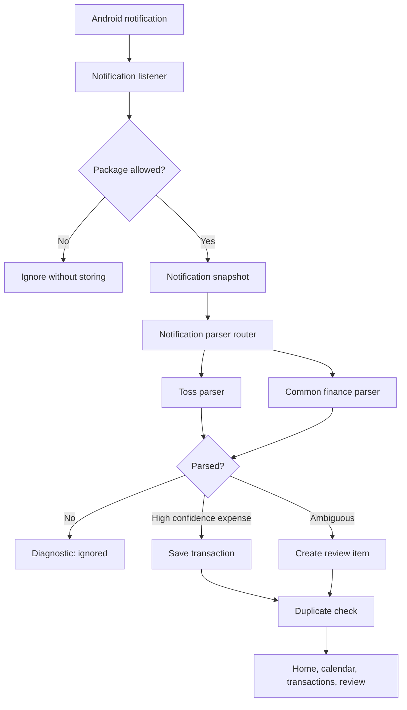

# Financial Notification Router Design

## Goal

AutoMoney should no longer depend only on Toss notifications. If a user pays with or transfers from another financial app, such as KB Kookmin Bank, the app should read that notification, detect likely money movement, and turn it into either an automatic transaction or a review item.

The safest first version is not "read every notification with numbers." It is an allowlisted financial-app router with conservative parsing. High-confidence card payments can be recorded automatically. Transfers, top-ups, refunds, deposits, account movement, and low-confidence matches go to Review.

## Current Problem

The notification listener currently returns immediately unless the package is Toss:

```kotlin
if (sbn.packageName != "viva.republica.toss") return
```

That means KB Kookmin Bank notifications are ignored before the parser sees them. This blocks real-world usage when Toss does not send an alert for activity that happened through another bank app.

## Recommended Approach

Use a notification router:

1. Accept notifications only from known or user-enabled financial apps.
2. Route Toss notifications to the existing Toss parser.
3. Route bank/card/pay app notifications to a common Korean finance parser.
4. Save high-confidence spending automatically.
5. Send ambiguous money movement to Review with a masked text preview.

This keeps the app useful without creating noisy records from shopping ads, coupons, delivery promotions, or random messages containing money-like won text.

## Scope

Included:

- Replace the hardcoded Toss-only listener filter with an allowlist check.
- Add a small registry of supported financial app packages.
- Add a parser interface so Toss and common finance parsing can coexist.
- Add a common Korean finance parser for amount and keyword detection.
- Mask account-like numbers before storing diagnostics or review text.
- Extend diagnostics to show which app produced the latest processed notification.
- Add tests for KB-style examples, card approval, transfer, deposit, top-up, refund, and promotional false positives.

Not included:

- OCR, SMS reading, email reading, or screen scraping.
- Automatic bank account balance syncing.
- Cloud backup or multi-device sync.
- Reading every installed app's notifications.
- Saving full account numbers.

## Data Flow



## Components

### Financial App Registry

Purpose: decide whether a notification should be inspected.

Initial behavior:

- Toss is enabled by default.
- KB Kookmin Bank can be added as a supported financial app.
- Unknown apps are ignored.
- Settings toggles are not required for the first implementation, but the registry should be structured so toggles can be added later without changing parser logic.

The first implementation should match exact package names. Android PackageManager labels may be used for display in diagnostics, but they should not be the primary matching rule.

### Parser Router

Purpose: pick the right parser for a notification snapshot.

Suggested interface:

```kotlin
interface NotificationParser {
    fun canParse(snapshot: NotificationSnapshot): Boolean
    fun parse(snapshot: NotificationSnapshot): ParseResult
}
```

The ingestion use case should depend on this interface or a router, not directly on `TossNotificationParser`.

### Common Korean Finance Parser

Purpose: parse bank, card, and pay notifications that follow common Korean money-alert patterns.

Signals:

- Amount: Korean won amount text, including comma-separated amounts.
- Spending keywords: payment, approval, use, withdrawal.
- Transfer keywords: transfer, remittance, receiver, sender.
- Deposit keywords: deposit, received.
- Top-up keywords: top-up, pay money, point recharge.
- Refund keywords: cancel, refund, approval cancellation.
- Account hints: account, account number, bank account-like number patterns.

Classification:

- Card approval/payment: `EXPENSE`, auto-confirm only when merchant and amount are clear.
- Transfer/withdrawal/account movement: `TRANSFER`, needs review.
- Deposit: `INCOME`, needs review unless the user later defines a trusted rule.
- Wallet top-up: `WALLET_TOPUP`, needs review.
- Refund/cancel: `REFUND`, needs review.
- Promotional or coupon text: ignored.

### Privacy Masking

Before saving text previews, diagnostics, or review memo text, mask sensitive patterns:

- Account-like numbers: keep at most the last 4 digits, for example `****1234`.
- Long continuous numbers that are not amounts should be masked.
- Amounts can remain visible because they are needed for accounting.
- Full notification text should not be stored if a masked preview is enough.

## Review Behavior

The app should stay conservative:

- If the parser is not confident, create a Review item instead of auto-recording.
- If the app sees an account number or transfer keyword, send it to Review.
- If the same amount and same notification hash already exist, mark it as duplicate.
- If a notification has multiple amounts, send it to Review unless the parser can clearly identify the transaction amount.

This matches the product goal: the user should not need to enter everything manually, but they should not have to clean up many wrong records either.

## Settings UI

This implementation should rename Toss-specific Settings text to a broader phrase:

- Current meaning: "When Toss payment or transfer notifications arrive..."
- Proposed meaning: "When notifications from allowed financial apps arrive, process them as automatic record candidates."

The existing real-notification diagnostics card should show:

- Source app label or package name.
- Result: saved, duplicate, ignored, error.
- Parsed type if available.
- Masked text preview.

## Error Handling

- If package is not allowlisted: ignore silently.
- If package is allowlisted but parsing fails: save diagnostic as ignored with reason.
- If parser throws: save diagnostic as error and continue listening.
- If duplicate: save diagnostic as duplicate.
- If a notification lacks amount or finance keywords: ignored.

## Testing Plan

Unit tests:

- Toss parser still works as before.
- Listener/package filtering accepts Toss and configured finance apps.
- Common parser extracts amount from Korean won text.
- KB-style card payment becomes high-confidence expense.
- KB-style transfer becomes needs-review transfer.
- Deposit becomes needs-review income.
- Wallet top-up becomes needs-review wallet top-up.
- Refund/cancel becomes needs-review refund.
- Promotion or coupon notifications with money amounts are ignored.
- Account-like numbers are masked before saved previews.

Device tests:

- Install on Galaxy phone.
- Enable notification access.
- Trigger a real KB Kookmin Bank notification.
- Check Settings diagnostics.
- Check Review or Transactions.
- Adjust examples based on real notification wording.

## Acceptance Criteria

- KB Kookmin Bank notifications are no longer ignored solely because they are not Toss.
- Supported financial apps can be added without changing the listener logic.
- Toss parsing remains functional.
- Bank transfer/account movement records go to Review, not automatic expense.
- Sensitive account-like numbers are masked.
- Promotional notifications with money amounts are ignored.
- Full unit test suite and debug build pass.
