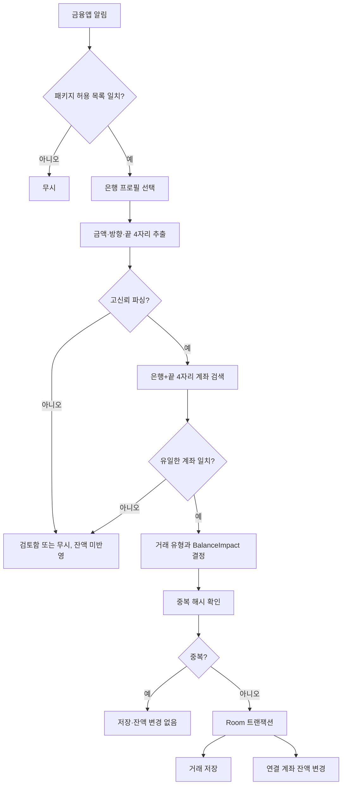

# Bank Notification Balance Sync Design

## 목표

등록한 은행 계좌와 금융앱 알림을 안전하게 연결해 실제 계좌 입출금을 자산 잔액에 반영한다. 자동 반영은 은행, 계좌 끝 4자리, 금액, 입출금 방향이 모두 확실한 경우로 제한한다. 거래 의미가 불확실한 송금은 검토 대상으로 남기되, 확인된 계좌 잔액 변화와 월 수입·지출 통계를 분리한다.

## 배경

현재 앱은 알림 거래의 `paymentMethod` 문자열과 자산 계좌 이름을 비교해 잔액을 변경한다. 이 방식은 다음 문제가 있다.

- 같은 은행에 계좌가 여러 개면 어느 계좌인지 구분할 수 없음
- 계좌 이름 변경 시 기존 거래의 잔액 효과를 되돌리지 못할 수 있음
- 거래 검토 상태가 잔액 반영 가능 여부와 결합되어 있음
- 송금처럼 잔액 변화는 명확하지만 거래 의미는 불명확한 경우를 표현하기 어려움
- 현재 금융앱 레지스트리와 파서는 토스와 KB 중심임

## 확정 범위

1차 대상 금융앱:

- KB국민은행
- 신한은행
- 하나은행
- 우리은행
- NH농협은행
- IBK기업은행
- 카카오뱅크
- 토스뱅크

포함:

- 자산 계좌에 은행 식별자와 계좌 끝 4자리 등록
- 금융앱별 정확한 Android 패키지 허용 목록
- 은행 프로필 기반 공통 입출금 파서
- 계좌 입금, 계좌 출금, 자동이체, ATM 출금 감지
- 고신뢰 계좌 매칭과 자산 잔액 자동 반영
- 송금의 잔액 반영과 거래 분류 검토 분리
- 중복 알림 방지와 원자적 DB 처리
- 기존 데이터 보존을 위한 Room 5→6 마이그레이션

제외:

- 서버 동기화와 멀티 디바이스 동기화
- 오픈뱅킹 API 직접 연동
- SMS, 이메일, OCR, 화면 스크래핑
- 신용카드 승인만으로 은행 계좌 잔액 차감
- 알림 형식의 사용자 학습 또는 자동 규칙 생성
- 전체 계좌번호 영구 저장
- 8개 금융앱 외 앱의 자동 잔액 반영

## 접근 방식

은행별 파서를 모두 복제하지 않고 `은행 프로필 + 공통 파서`를 사용한다.

은행 프로필은 다음 정보만 소유한다.

- 안정적인 은행 식별자
- 표시 이름
- 검증된 Android 패키지명 집합
- 입금, 출금, 송금, 제외 키워드
- 해당 앱에 필요한 추가 계좌표시 규칙

공통 파서는 금액, 방향, 계좌 끝 4자리와 이벤트 종류를 표준 결과로 변환한다. 공통 규칙으로 처리할 수 없는 은행만 프로필별 작은 오버라이드를 사용한다. 패키지명은 앱 개편으로 바뀔 수 있으므로 은행당 단일 문자열이 아니라 검증된 문자열 집합으로 관리한다.

전용 은행 앱은 패키지명으로 은행 후보를 확정할 수 있다. 토스처럼 여러 금융기관의 거래를 함께 보여주는 앱은 패키지명만으로 토스뱅크를 확정하지 않는다. 알림 본문에 은행명과 계좌 식별 정보가 명시된 경우에만 해당 은행 후보를 만들고, 그렇지 않으면 자동 잔액 반영을 금지한다.

모든 금융앱 알림을 읽는 범용 정규식 방식은 사용하지 않는다. 정확한 패키지 허용 목록에 없는 앱은 잔액 자동 반영 대상이 아니다.

## 데이터 모델

### BankProvider

8개 은행을 나타내는 안정적인 식별자다. UI 표시 이름이나 앱 이름과 분리한다.

```kotlin
enum class BankProvider {
    KB,
    SHINHAN,
    HANA,
    WOORI,
    NH,
    IBK,
    KAKAO_BANK,
    TOSS_BANK
}
```

### AssetAccount

기존 모델에 다음 nullable 필드를 추가한다.

```kotlin
val bankProvider: BankProvider?
val accountLast4: String?
```

은행 계좌가 아닌 현금, 페이, 증권, 기타 자산과 마이그레이션된 기존 계좌는 두 필드가 `null`일 수 있다. 자동 잔액 반영은 두 값이 모두 있고 형식 검증을 통과한 은행 계좌만 대상으로 한다.

사용자가 전체 계좌번호를 입력하면 UI에서 숫자만 정규화하고 끝 4자리만 저장 계층에 전달한다. 전체 번호는 Room, SharedPreferences, SavedState, 로그, 진단 정보에 저장하지 않는다. UI에는 `****1234` 형식만 표시한다.

### BankAccountHint

파서가 반환하는 일시적 도메인 값이다. 원문 전체 계좌번호는 포함하지 않는다.

```kotlin
data class BankAccountHint(
    val provider: BankProvider,
    val accountLast4: String,
    val direction: AccountMovementDirection,
    val eventKind: BankEventKind
)
```

### 거래와 잔액 효과

`MoneyTransaction`과 `TransactionEntity`에 다음 필드를 추가한다.

```kotlin
val linkedAssetAccountId: Long?
val balanceImpact: BalanceImpact?
```

`BalanceImpact` 값:

- `CREDIT`: 연결 계좌 잔액 증가
- `DEBIT`: 연결 계좌 잔액 감소
- `NONE`: 잔액 변경 없음
- `null`: 마이그레이션된 기존 거래의 레거시 계산 방식

새 거래는 항상 명시적인 `BalanceImpact`를 저장한다. `null`은 DB 5→6 마이그레이션으로 들어온 기존 거래에만 허용한다. 기존 거래 수정 또는 삭제 시 `null`이면 현재의 `paymentMethod` 기반 잔액 계산으로 기존 효과를 되돌린다. 수정 저장 후에는 계좌 ID와 명시적 잔액 효과로 전환한다.

`linkedAssetAccountId`는 자산 계좌의 안정적인 ID를 사용한다. 새 알림 거래의 잔액 계산은 계좌 이름이나 은행 별칭으로 수행하지 않는다.

수동 추가, 거래 수정, 알림 수집 등 모든 신규 저장 경로는 `balanceImpact`를 명시한다. 수동 추가와 거래 수정에서 사용자가 계좌를 선택하면 계좌 ID를 함께 저장한다. 선택하지 않은 신규 거래는 `NONE`을 사용한다.

### 알림 고유 식별자

현재처럼 알림 본문만 해시하면 같은 금액과 문구가 반복되는 정상 거래가 영구 중복으로 오인될 수 있다. `NotificationSnapshot`에 Android 알림 고유키를 추가하고 다음 우선순위로 `sourceNotificationHash`를 중앙에서 생성한다.

1. 실제 알림: 패키지명 + `StatusBarNotification.key` + 게시 시각
2. 고유키가 없는 테스트·가상 알림: 패키지명 + 게시 시각 + 마스킹 전 원문 내용의 해시

같은 알림의 내용이 갱신되거나 재전달되어도 고유키와 게시 시각이 같으면 같은 해시를 만든다. 문구가 같은 별도 거래는 다른 키 또는 게시 시각으로 구분한다. 파서별 자체 해시 함수는 제거하고 알림 수집 계층에서 한 번만 생성한다.

## 알림 처리 흐름



## 고신뢰 자동 반영 조건

다음 조건을 모두 만족해야 한다.

1. 알림 패키지가 선택된 은행의 검증된 허용 목록과 정확히 일치함
2. 금액이 하나로 명확하며 0원보다 큼
3. 입금·출금 방향이 명시적 문구로 확인됨. 송금은 `보냄`과 `받음`이 구분되어야 함
4. 계좌 끝 4자리가 명확히 추출됨
5. 같은 은행과 끝 4자리를 가진 활성 계좌가 정확히 하나임
6. 광고, 이벤트, 인증, 잔액조회, 보안 안내가 아님
7. 기존 알림 해시와 중복되지 않음
8. 차감 후 잔액이 음수가 되지 않음

금액의 위치나 문맥이 불명확하거나 여러 금액이 경쟁하면 자동 반영하지 않는다. 은행별 실제 알림 예제가 없어도 위 조건을 모두 만족하는 엄격한 공통 형식만 처리하며, 나머지는 검토 또는 무시한다.

## 거래별 잔액 규칙

| 알림 의미 | 거래 처리 | 잔액 처리 |
|---|---|---|
| 계좌 입금 | 일반 입금 저장 | 일치 계좌 `CREDIT` |
| 계좌 출금 | 일반 출금 저장 | 일치 계좌 `DEBIT` |
| 자동이체·ATM 출금 | 출금 저장 | 일치 계좌 `DEBIT` |
| 받은 송금 | `TRANSFER_UNKNOWN` 검토 | 확실한 계좌에 `CREDIT` |
| 보낸 송금 | `TRANSFER_UNKNOWN` 검토 | 확실한 계좌에 `DEBIT` |
| 내 계좌 간 이체 | 각각 송금 검토 | 출금 계좌 감소, 입금 계좌 증가 |
| 신용카드 승인 | 거래 기록 규칙만 적용 | `NONE` |
| 체크카드 사용 | 은행 앱의 실제 출금 알림만 대상 | 출금 알림에서 `DEBIT` |
| 카드 취소 | 카드 취소만으로 잔액 변경 없음 | 실제 계좌 입금에서 `CREDIT` |

송금은 N분의 1 정산, 환급, 용돈, 일반 이체, 실제 지출을 알림만으로 구분하기 어렵다. 따라서 송금 거래는 항상 검토 대상으로 저장하고 검토 완료 전 월 수입·지출 통계에 포함하지 않는다. 다만 은행, 계좌, 금액, 방향이 확실하면 실제 자산 잔액은 즉시 반영한다.

검토에서 사용자는 `정산금`, `수입`, `지출`, `내 계좌 이체`, `통계 제외`, `알림 오인식` 중 적절한 의미를 선택한다. `통계 제외`는 실제 계좌 이동 효과를 유지하고 월 수입·지출 통계에서만 제외한다. `알림 오인식`은 `BalanceImpact.NONE`으로 바꾸어 이미 반영된 잔액 효과를 되돌린다. 거래 금액, 연결 계좌 또는 잔액 효과가 바뀌면 저장소는 기존 효과를 먼저 되돌린 후 새 효과를 적용한다.

자산 잔액의 기준은 `BalanceImpact`이고 통계 포함 여부의 기준은 거래 유형과 상태다. 두 기준을 다시 결합하지 않는다.

## 컴포넌트 경계

### BankProviderRegistry

- 패키지명에서 은행 후보 또는 복수 금융기관 앱 프로필을 찾음
- 은행별 여러 패키지명을 지원함
- 검증되지 않은 패키지를 활성화하지 않음
- 표시 이름과 파서 선택 정보를 제공함
- 토스처럼 여러 은행을 중계하는 앱은 본문 근거 없이 특정 은행을 반환하지 않음

### BankNotificationProfile

- 은행별 키워드와 최소 예외 규칙만 보유함
- 거래 저장소나 UI에 의존하지 않음
- 실제 알림 샘플이 없는 추측성 문구를 추가하지 않음

### CommonBankNotificationParser

- 허용된 프로필의 알림만 파싱함
- 금액, 방향, 이벤트 종류, 끝 4자리를 구조화함
- 전체 계좌번호나 원문 알림을 결과에 유지하지 않음
- 파싱 실패를 예외가 아니라 명시적 `Ignored` 또는 `NeedsReview` 결과로 반환함

### AssetAccountMatcher

- `BankProvider + accountLast4`로 계좌를 찾음
- 정확히 하나일 때만 성공함
- 없음과 여러 개를 서로 다른 실패 사유로 반환함
- 순수 함수로 구현해 단위 테스트 가능하게 함

### BalanceImpactPolicy

- 파싱 결과와 거래 의미에서 `CREDIT`, `DEBIT`, `NONE`을 결정함
- 거래 검토 상태와 독립적으로 동작함
- 송금은 검토 상태여도 확실한 계좌 이동 효과를 반환할 수 있음

### RoomMoneyRepository

- 거래 삽입과 잔액 변경을 하나의 Room 트랜잭션으로 처리함
- 수정 시 이전 효과 제거 후 새 효과 적용
- 삭제 시 저장된 효과 제거
- `linkedAssetAccountId`가 없는 새 알림은 잔액을 변경하지 않음
- 마이그레이션된 레거시 거래만 기존 이름 기반 계산을 사용함
- DB 트랜잭션 안에서 연결 계좌가 여전히 존재하고 파싱된 은행·끝 4자리와 일치하는지 재검증함

## DB 마이그레이션

Room 스키마를 5에서 6으로 올린다.

`asset_accounts` 추가 열:

- `bankProvider TEXT NULL`
- `accountLast4 TEXT NULL`

`transactions` 추가 열:

- `linkedAssetAccountId INTEGER NULL`
- `balanceImpact TEXT NULL`

기존 행은 모두 `null`로 유지한다. 계좌 이름으로 은행이나 끝 4자리를 추측하지 않는다. 사용자가 기존 은행 계좌를 편집해 식별 정보를 추가해야 자동 잔액 반영 대상이 된다.

`transactions.linkedAssetAccountId` 인덱스를 추가한다. 현재 계좌 삭제 기능이 없으므로 1차 구현은 소프트 참조를 사용한다. 향후 계좌 삭제가 추가되면 거래 보존과 참조 해제 정책을 별도 설계한다.

## 개인정보와 로컬 저장

- 전체 계좌번호는 영구 저장하지 않음
- 끝 4자리만 저장하고 UI에서 마스킹함
- 계좌번호 원문을 로그, 예외 메시지, 분석 이벤트, 진단 카드에 넣지 않음
- 알림 진단 미리보기에는 기존 `SensitiveTextMasker`를 적용함
- Compose 입력 상태는 저장 가능한 상태로 보존하지 않고 저장 또는 취소 시 비움
- 서버 전송과 원격 분석은 추가하지 않음

Android 앱 백업 정책은 전체 거래 DB에 영향을 주는 별도 보안 결정이므로 이 기능에서 임의로 변경하지 않는다. 이번 기능은 기존 백업 정책과 관계없이 전체 계좌번호를 저장하지 않는 것으로 노출 범위를 제한한다.

## 오류 처리

- 미지원 패키지: 저장 없이 무시
- 지원 패키지지만 금액 없음: 마스킹된 진단 사유 기록, 거래 미생성
- 방향 불명확: 검토 후보, 잔액 미반영
- 계좌 정보 없음: `ACCOUNT_UNMATCHED`, 잔액 미반영
- 계좌 중복 일치: `ACCOUNT_AMBIGUOUS`, 잔액 미반영
- 연결 계좌가 저장 직전에 변경 또는 삭제됨: 같은 Room 트랜잭션에서 `BalanceImpact.NONE`과 `ACCOUNT_UNMATCHED` 검토 항목으로 저장
- 잔액 부족: `BALANCE_MISMATCH`, 잔액 미반영
- 중복 해시: 기존 중복 처리 사용, 이중 차감 없음
- 저장 또는 잔액 갱신 실패: Room 트랜잭션 전체 롤백
- 파서 예외: 리스너를 중단하지 않고 마스킹된 오류 진단 기록

## 테스트 전략

### 단위 테스트

- 8개 은행 프로필의 정확한 패키지 라우팅
- 토스 패키지만으로 토스뱅크 계좌를 확정하지 않는지 확인
- 입금, 출금, 자동이체, ATM 출금, 송금 추출
- 여러 금액, 금액 없음, 방향 없음 거부
- 광고, 이벤트, 인증, 잔액조회, 보안 안내 오인식 방지
- 전체 계좌번호 입력에서 끝 4자리만 저장 계층으로 전달
- 계좌 유일 일치, 미일치, 중복 일치
- 입금 `CREDIT`, 출금 `DEBIT`, 카드 승인 `NONE`
- 송금은 검토 상태지만 확실한 잔액 효과 유지
- 송금을 통계에서 제외해도 잔액 효과는 유지
- 알림 오인식 처리 시 기존 잔액 효과 복구
- 잔액 부족 시 효과 차단
- 거래 수정, 삭제, 알림 오인식 처리 시 기존 잔액 효과 복구
- 레거시 `balanceImpact == null` 동작 유지

### DB 테스트

- Room 5→6 마이그레이션 후 기존 거래와 자산 보존
- 새 열의 기본값이 `null`인지 확인
- 거래 저장과 잔액 변경의 원자성
- 중복 알림 삽입 경쟁에서 한 번만 잔액 반영
- 본문이 같은 별도 알림은 서로 다른 거래로 저장
- 동일 Android 알림의 반복 전달은 한 번만 저장
- 수정 시 이전 효과 제거와 새 효과 적용이 한 트랜잭션인지 확인

### 기기 테스트

- Galaxy 기기에서 알림 접근 권한 활성화
- 지원 금융앱별 실제 입출금 알림 수신
- 알림 원문과 앱 진단의 마스킹 확인
- 유일 계좌 자동 반영 확인
- 미일치·중복 계좌 검토 이동 확인
- 송금의 잔액 반영과 통계 제외 확인
- 앱 재시작 후 거래와 잔액 일관성 확인

실제 알림 샘플을 확보하지 못한 금융앱은 엄격한 공통 패턴 테스트까지만 통과시킨다. 앱별 자동 반영 지원 완료 표시는 실제 기기 샘플 검증 후에만 사용한다.

## 완료 조건

- 8개 은행 프로필이 검증된 패키지 허용 목록으로 등록됨
- 자산 계좌에 은행과 끝 4자리를 등록·수정할 수 있음
- 전체 계좌번호가 DB, 로그, 진단 정보에 남지 않음
- 고신뢰 입출금만 연결 계좌 잔액을 자동 변경함
- 송금은 잔액 변화와 거래 검토가 분리됨
- 통계 제외와 알림 오인식이 서로 다른 잔액 결과를 만듦
- 신용카드 승인만으로 은행 계좌 잔액이 바뀌지 않음
- 계좌 미일치, 중복 일치, 잔액 부족은 자동 반영되지 않음
- 중복 알림이 이중 차감을 만들지 않음
- 기존 거래 수정·삭제의 잔액 복구 동작이 유지됨
- Room 5→6 마이그레이션 테스트 통과
- 전체 단위 테스트와 `assembleDebug` 통과
- 연결된 Galaxy 기기에서 대표 입출금·송금 흐름 확인
